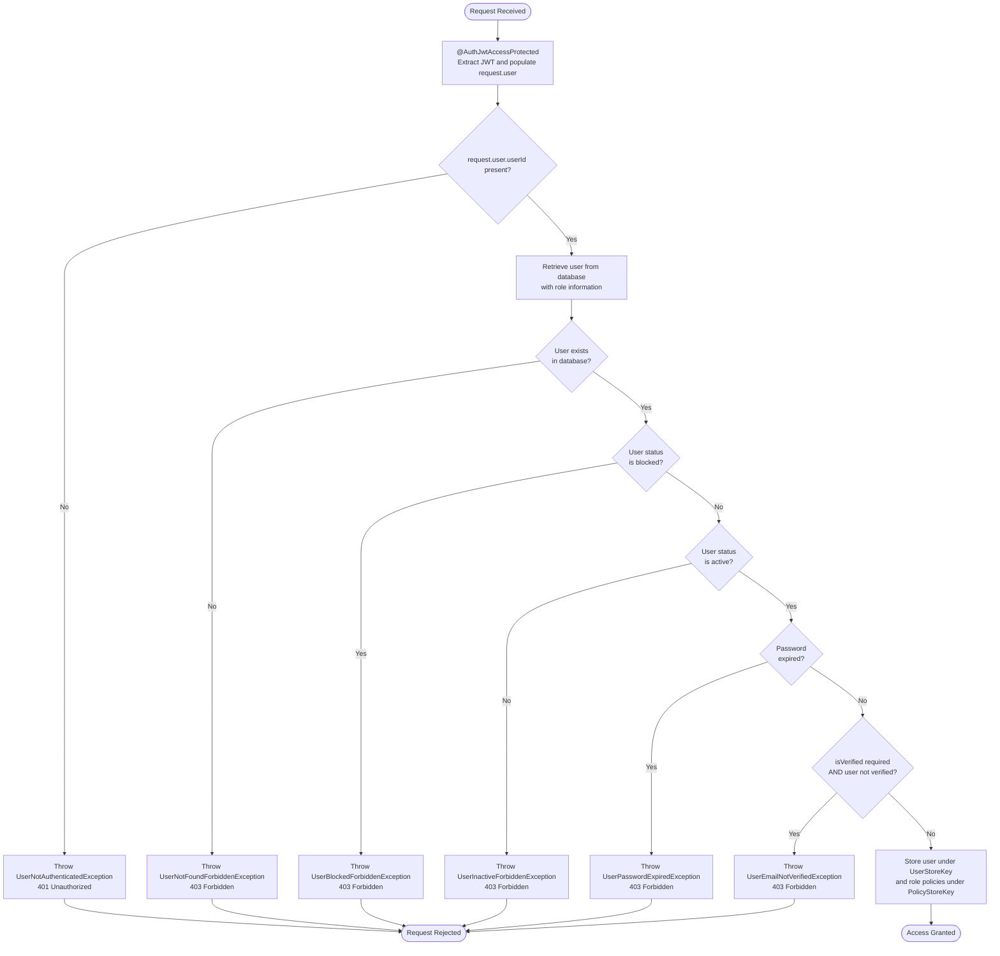
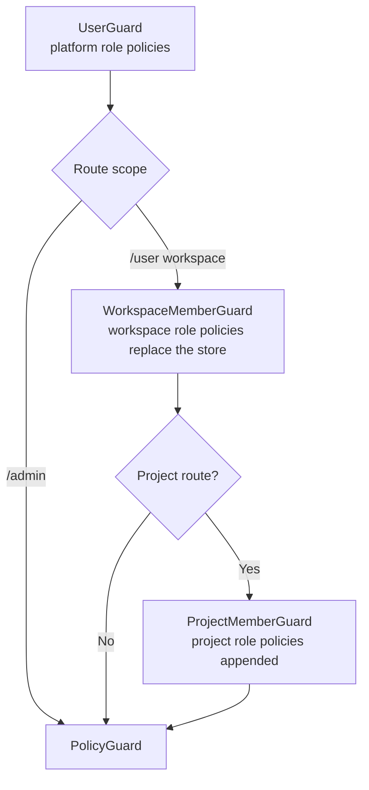
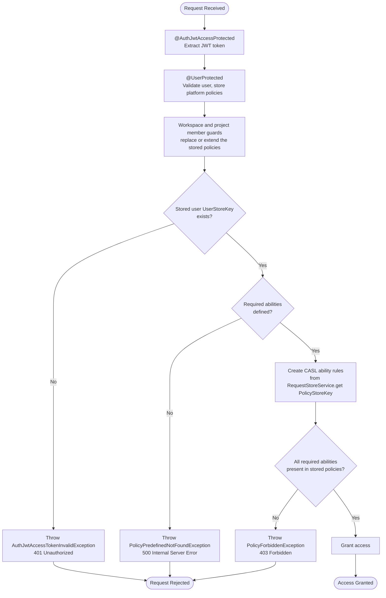
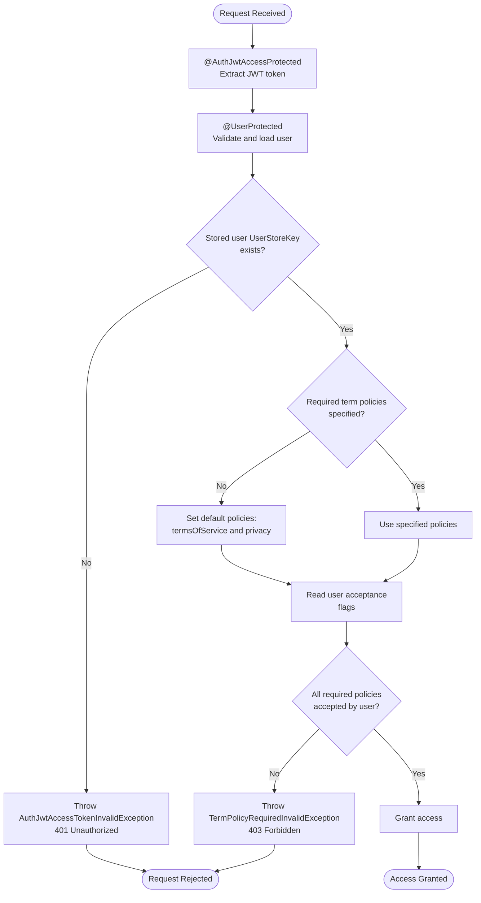
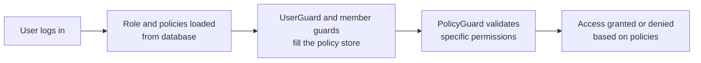

# Authorization Documentation

Decorator locations:

- **UserProtected**: `src/modules/user/decorators`
- **PolicyProtected**: `src/modules/policy/decorators`
- **TermPolicyAcceptanceProtected**: `src/modules/term-policy/decorators`

The workspace and project decorators (`WorkspaceProtected`, `WorkspaceMemberProtected`, `ProjectProtected`, `ProjectMemberProtected`) are summarised here and documented in full by [Workspace][ref-doc-workspace] and [Project][ref-doc-project].

## Overview

Authorization is CASL only. Guards stack as:

- user (loads the platform role's policies)
- workspace and project membership (each adds the policies of the member's role)
- policy (decides)
- term-policy acceptance

NestJS applies each layer on the route handler. A role decides nothing by itself: it is a named set of policies, and `PolicyGuard` evaluates the policies the earlier guards collected.

## Related Documents

- [Authentication Documentation][ref-doc-authentication] - JWT, sessions, and API keys
- [Activity Log Documentation][ref-doc-activity-log] - Authz-related activity rows
- [Term Policy Documentation][ref-doc-term-policy] - Acceptance gating
- [Device Documentation][ref-doc-device] - Device revoke and sessions
- [Workspace Documentation][ref-doc-workspace] - Workspace guards and `x-workspace-id`
- [Project Documentation][ref-doc-project] - Project guards and project roles
- [Feature Flag Documentation][ref-doc-feature-flag] - `@FeatureFlagProtected` in the stack
- [Security and Middleware Documentation][ref-doc-security-and-middleware] - Rate limits and headers

## Table of Contents

- [Overview](#overview)
- [Related Documents](#related-documents)
- [Decorator Order](#decorator-order)
- [User Protected](#user-protected)
  - [Decorators](#decorators)
    - [UserProtected() Decorator](#userprotected-decorator)
    - [UserCurrent() Parameter Decorator](#usercurrent-parameter-decorator)
  - [Guards](#guards)
    - [UserGuard](#userguard)
  - [Important Notes](#important-notes)
- [Roles and the Policy Store](#roles-and-the-policy-store)
- [Policy Protected](#policy-protected)
  - [Decorators](#decorators-2)
    - [PolicyProtected() Decorator](#policyprotected-decorator)
  - [Guards](#guards-2)
    - [PolicyGuard](#policyguard)
  - [CASL Integration](#casl-integration)
  - [Important Notes](#important-notes-2)
- [Term Policy Acceptance Protected](#term-policy-acceptance-protected)
  - [Decorators](#decorators-3)
    - [TermPolicyAcceptanceProtected() Decorator](#termpolicyacceptanceprotected-decorator)
  - [Guards](#guards-3)
    - [TermPolicyGuard](#termpolicyguard)
  - [Important Notes](#important-notes-3)
- [Workspace and Project Protected](#workspace-and-project-protected)
- [Role Catalog and Policies](#role-catalog-and-policies)
  - [Role Catalog](#role-catalog)
  - [Managing Roles and Policies](#managing-roles-and-policies)
  - [Assigning Roles](#assigning-roles)
  - [Important Notes](#important-notes-4)

## Decorator Order

NestJS evaluates stacked decorators bottom-up, so the guard NEAREST the method executes FIRST. The order encodes which gate rejects first, so a reshuffle changes the error a caller sees even when the application still boots. Every route uses this order, top to bottom in source:

```typescript
@Doc({ summary: '…' })                     // 1.  OpenAPI operation + global error kit
@Response('example.action')                // 2.  @Response / @ResponsePagination / @ResponseFile
@TermPolicyAcceptanceProtected()           // 3.  Term policy acceptance
@PolicyProtected({ ... })                  // 4.  CASL policy ability
@ProjectMemberProtected(...)               // 5.  Project role policies
@ProjectProtected()                        // 6.  Project resolution from :projectId
@WorkspaceMemberProtected()                // 7.  Workspace role policies
@WorkspaceProtected()                      // 8.  Workspace resolution from x-workspace-id
@UserProtected()                           // 9.  User status and platform role policies
@FeatureFlagProtected('exampleKey')        // 10. Feature flag
@AuthJwtAccessProtected()                  // 11. JWT access or refresh
@ApiKeyProtected()                         // 12. API key
@HttpCode(HttpStatus.OK)                   // 13. HTTP status, only when it differs from the default
@Get('/endpoint')                          // 14. HTTP method, always last
```

A route takes only the slots it needs; the relative order of the ones it takes never changes. Guard execution therefore runs `@ApiKeyProtected()` → `@AuthJwtAccessProtected()` → `@FeatureFlagProtected()` → `@UserProtected()` → `@WorkspaceProtected()` → `@WorkspaceMemberProtected()` → `@ProjectProtected()` → `@ProjectMemberProtected()` → `@PolicyProtected()` → `@TermPolicyAcceptanceProtected()`.

- A social-login guard (`@AuthSocialGoogleProtected()`) takes the JWT slot for that route.
- `@RequestThrottle({ ... })` sits outside this order. It mounts an interceptor, so it runs after every guard whatever its position in the stack. Routes declare it below `@ApiKeyProtected()`, so the rate limit reads next to the guards protecting the same route. See [Security and Middleware][ref-doc-security-and-middleware].
- Activity logging takes no slot. Domains build events with `ActivityLogDomain.prepare` and queue them with `ActivityLogDomain.stagePrepared`, and the global `ActivityLogInterceptor` writes them after the handler settles. See [Activity Log][ref-doc-activity-log].
- A guard that depends on state an earlier guard sets sits ABOVE that guard in source, so it runs after it.
- `@FeatureFlagProtected()` sits ABOVE `@AuthJwtAccessProtected()` so the flag guard sees `request.user`. Below it the guard always takes its anonymous branch, which makes `targetUserIds` and any rollout below 100% inert on that route.
- The workspace and project slots are used by the `/user` scope. The `/admin` scope reaches the same resources through `@PolicyProtected()` alone, which evaluates the caller's platform role policies, and takes the workspace or project id from the path.

## User Protected

`UserProtected` applies `UserGuard`, which reads the JWT `userId`, loads the user with its platform role, and stores the role's policies in the policy store. Email verification defaults to on.

### Decorators

#### UserProtected Decorator

**Method decorator** that applies `UserGuard` to route handlers.

**Parameters:**
- `isVerified` (boolean, optional): Whether to require email verification. Default: `true`

**Usage:**

`@UserProtected()` requires email verification. `@UserProtected(false)` skips that check. The default is `true`. Shared profile:

```typescript
@TermPolicyAcceptanceProtected()
@UserProtected()
@AuthJwtAccessProtected()
@Get('/profile/get')
async profile(
  @AuthJwtPayload('userId') userId: string
): Promise<IResponseReturn<IUserProfile>> {
  return this.userProfileHttpService.getProfile(userId);
}
```

#### UserCurrent Parameter Decorator

Reads back the authenticated user `UserGuard` stored, or one of its fields when a field name is passed.

**Returns:** `IUser`, or the named field of it. Both are non-null: an empty store key, or a field holding `null`, throws `RequestContextMissingException` (500, `50304`).

**Usage:**

Refresh is a call site:

```typescript
@UserProtected()
@AuthJwtRefreshProtected()
@Post('/refresh')
async refresh(
  @UserCurrent() user: IUser,
  @AuthJwtToken() refreshToken: string
): Promise<IResponseReturn<IAuthToken>> {
  return this.userAuthHttpService.refresh(user, refreshToken);
}
```

### Guards

#### `UserGuard`

The guard implementation that performs the actual validation.

The `UserProtected` decorator follows this validation sequence:

1. **Authentication Check**: Verifies that the JWT strategy put a `userId` on `request.user`
2. **User Lookup**: Retrieves user from database with role information
3. **User Existence**: Ensures user record exists
4. **Blocked Check**: Rejects a user whose status is `blocked`
5. **Status Validation**: Confirms user status is `active`
6. **Password Expiry**: Checks if password has expired
7. **Email Verification**: Validates email verification if required
8. **Policy Store**: Stores the user's platform role policies under `PolicyStoreKey`

**Flow Diagram:**



### Important Notes

- `@UserProtected()` requires `@AuthJwtAccessProtected()` to run first, so JWT sits below `@UserProtected()` in source (nearest the method). Nest runs guards bottom-up.
- `@AuthJwtAccessProtected()` populates `request.user` from JWT token. See [Authentication Documentation][ref-doc-authentication] for details
- This decorator stores the validated user via `RequestStoreService.set(UserStoreKey, user)` (read back with `RequestStoreService.get(UserStoreKey)`, e.g. by `@UserCurrent()`) and the platform role's policies via `RequestStoreService.set(PolicyStoreKey, user.role.policies)`, both required by downstream guards

## Roles and the Policy Store

One `Role` model covers every level. A role has a `scope` (`platform`, `workspace`, or `project`), an immutable `key`, and a `name` and `description` an admin edits. The pair `(scope, key)` is unique. The role a user, a workspace member, or a project member holds is a foreign key (`roleId`) to that model, and each role owns the policies that define what it may do.

No decorator gates a route by role. The role reaches a route through the policy store: an array of `Policy` rows kept in the request store under `PolicyStoreKey`, which `PolicyGuard` reads.

| Guard | Effect on `PolicyStoreKey` |
|---|---|
| `UserGuard` | Writes the policies of the user's platform role |
| `WorkspaceMemberGuard` | Overwrites the store with the policies of the member's workspace role |
| `ProjectMemberGuard` | Appends the policies of the member's project role to what the workspace guard wrote |
| `PolicyGuard` | Reads the store and decides |



Reading the current role: `@UserCurrent()` returns the stored `IUser`, whose `role` carries `id`, `scope`, `key`, `name`, and `policies`. `@WorkspaceMemberCurrent()` and `@ProjectMemberCurrent()` return the membership row with its role.

A domain that has to branch on a capability calls `PolicyDomain.can(action, subject)`. It builds a CASL ability from the policy store of the current request and answers `true` or `false`.

`superAdmin` holds a persisted policy `manage` on `all`. That row is what lets it pass every `PolicyGuard`, and the policies of the `superAdmin` role cannot be created, updated, or deleted (`PolicyImmutableException`, 403, `51104`). The platform `admin` role holds an explicit subject list, not `all`.

## Policy Protected

`PolicyProtected` is CASL. A policy names an action (`read`, `create`, `update`, `delete`, `manage`) on a subject (`user`, `role`, `session`, and the rest of `EnumPolicySubject`).

### Decorators

#### PolicyProtected Decorator

**Method decorator** that applies `PolicyGuard` to route handlers.

**Parameters:**
- `...requiredPolicies` (PolicyRequestDto[]): One or more `{ subject, action[] }` objects naming the required permissions

**Available Policy Actions:**
- `EnumPolicyAction.manage` - Full control over a subject
- `EnumPolicyAction.read` - Read/view permission
- `EnumPolicyAction.create` - Create new resources
- `EnumPolicyAction.update` - Modify existing resources
- `EnumPolicyAction.delete` - Remove resources

**Available Policy Subjects:**
- `EnumPolicySubject.all` - All resources
- `EnumPolicySubject.apiKey` - API key management
- `EnumPolicySubject.role` - Role management
- `EnumPolicySubject.user` - User management
- `EnumPolicySubject.session` - Session management
- `EnumPolicySubject.activityLog` - Activity logs
- `EnumPolicySubject.passwordHistory` - Password history
- `EnumPolicySubject.termPolicy` - Terms and policies
- `EnumPolicySubject.featureFlag` - Feature flags
- `EnumPolicySubject.device` - Device management
- `EnumPolicySubject.workspace` - Workspace management
- `EnumPolicySubject.project` - Project management
- `EnumPolicySubject.analytic` - Admin analytic dashboard, anomaly, and fraud read routes, and the workspace analytic routes
- `EnumPolicySubject.workspaceMember` - Workspace member role change and removal
- `EnumPolicySubject.workspaceInvite` - Workspace invite create, resend, and revoke
- `EnumPolicySubject.workspaceJoinRequest` - Workspace join request accept and reject
- `EnumPolicySubject.projectMember` - Project member assign, role change, and removal

**Usage:**

```typescript
@PolicyProtected({
  subject: EnumPolicySubject.user,
  action: [EnumPolicyAction.read]
})
@UserProtected()
@AuthJwtAccessProtected()
@Get('/list')
async list(
  @Query({ schema: UserListRequestSchema }) query: UserListRequestDto
): Promise<IResponsePaginationReturn<IUserList>> {
  return this.userHttpService.getListOffsetByAdmin(query);
}

@PolicyProtected({
  subject: EnumPolicySubject.user,
  action: [EnumPolicyAction.read, EnumPolicyAction.update]
})
@UserProtected()
@AuthJwtAccessProtected()
@Patch('/update/:userId/status')
async updateStatus(
  @Param('userId', { schema: RequestUuidSchema }) userId: string,
  @AuthJwtPayload('userId') updatedBy: string,
  @Body({ schema: UserUpdateStatusRequestSchema }) body: UserUpdateStatusRequestDto
): Promise<IResponseReturn<void>> {
  return this.userHttpService.updateStatusByAdmin(userId, body, updatedBy);
}

@PolicyProtected(
  {
    subject: EnumPolicySubject.user,
    action: [EnumPolicyAction.read]
  },
  {
    subject: EnumPolicySubject.session,
    action: [EnumPolicyAction.read, EnumPolicyAction.delete]
  }
)
@UserProtected()
@AuthJwtAccessProtected()
@Delete('/revoke/:sessionId')
async revoke(
  @Param('userId', { schema: RequestUuidSchema }) userId: string,
  @Param('sessionId', { schema: RequestUuidSchema }) sessionId: string,
  @AuthJwtPayload('userId') revokedBy: string
): Promise<IResponseReturn<void>> {
  return this.sessionHttpService.revokeByAdmin(userId, sessionId, revokedBy);
}
```

### Guards

#### `PolicyGuard`

The guard reads the user and the stored policies off the request store and hands both to `PolicyDomain.validatePolicyGuard`, which evaluates them through CASL.

The `PolicyProtected` decorator follows this validation sequence:

1. **User Validation**: Verifies that the stored user (`RequestStoreService.get(UserStoreKey)`) exists
2. **Required Policies Check**: Validates that required policies are declared on the handler
3. **Ability Creation**: Creates CASL ability rules from the stored policies (`RequestStoreService.get(PolicyStoreKey)`)
4. **Permission Validation**: Checks that every required `(subject, action)` pair is allowed
5. **Access Decision**: Grants or denies access based on permission match

**Flow Diagram:**



### CASL Integration

The project uses [CASL][casl] for permission checks:

**PolicyAbilityFactory:**

- `createForUser(policies)`: Builds CASL ability rules from the stored policies
- `handlerPolicies(userPolicies, policies)`: Returns true only when every required action on each subject is allowed, using CASL's `can()`

**PolicyDomain:**

- `validatePolicyGuard(user, policies, requiredPolicies)`: The guard's decision
- `can(action, subject)`: A boolean check against the current request's policy store, for a domain that branches on a capability

### Important Notes

- `@PolicyProtected()` reads the policies the user and member guards stored and the user `@UserProtected()` stored, all of which depend on `@AuthJwtAccessProtected()`
- The stack reads top to bottom `@PolicyProtected()` → `@ProjectMemberProtected()` → `@WorkspaceMemberProtected()` → `@UserProtected()` → `@AuthJwtAccessProtected()`. See [Authentication Documentation][ref-doc-authentication] for `@AuthJwtAccessProtected()` details
- Without a stored user the guard throws `AuthJwtAccessTokenInvalidException` (401)
- `superAdmin` passes every `@PolicyProtected` route through its persisted `manage` on `all` policy. CASL treats `manage` as every action and `all` as every subject.
- Every action of a required policy has to be present in the stored policies. Requiring `[EnumPolicyAction.update, EnumPolicyAction.delete]` on the `EnumPolicySubject.user` subject grants access only when the caller holds both actions, not just one.

## Term Policy Acceptance Protected

`TermPolicyAcceptanceProtected` rejects the request until the user has accepted the required policies (Terms of Service, Privacy Policy, and the rest of the set).

Details: [Term Policy Documentation][ref-doc-term-policy].

### Decorators

#### TermPolicyAcceptanceProtected Decorator

**Method decorator** that applies `TermPolicyGuard` to route handlers.

**Parameters:**
- `...requiredTermPolicies` (EnumTermPolicyType[], optional): One or more term policy types that must be accepted. If not provided, defaults to `termsOfService` and `privacy`

**Available Term Policy Types:**
- `EnumTermPolicyType.termsOfService` - Terms of Service acceptance
- `EnumTermPolicyType.privacy` - Privacy Policy acceptance
- `EnumTermPolicyType.cookies` - Cookies Policy acceptance
- `EnumTermPolicyType.marketing` - Marketing consent acceptance

**Usage:**

```typescript
@TermPolicyAcceptanceProtected()
@UserProtected()
@AuthJwtAccessProtected()
@Get('/acceptance/list')
async listAccepted(
  @Query({ schema: TermPolicyAcceptedListRequestSchema })
  query: TermPolicyAcceptedListRequestDto,
  @AuthJwtPayload('userId') userId: string
): Promise<IResponsePaginationReturn<ITermPolicyUserAcceptance>> {
  return this.termPolicyAcceptanceHttpService.getListUserAccepted(
    userId,
    query
  );
}
```

The decorator takes optional `EnumTermPolicyType` arguments. With none, it requires `termsOfService` and `privacy`. Shared and admin routes in this checkout pass no arguments.

### Guards

#### `TermPolicyGuard`

The guard implementation that validates user term policy acceptance.

The `TermPolicyAcceptanceProtected` decorator follows this validation sequence:

1. **User Validation**: Verifies that the stored user (`RequestStoreService.get(UserStoreKey)`) exists
2. **Default Policy Check**: If no required policies specified, sets defaults to `termsOfService` and `privacy`
3. **Term Policy Lookup**: Reads the user's acceptance flags (`termsOfServiceAccepted`, `privacyAccepted`, `marketingAccepted`, `cookiesAccepted`) from the stored user
4. **Acceptance Validation**: Checks if all required term policies are accepted
5. **Access Decision**: Grants access only if all required policies are accepted

**Flow Diagram:**



### Important Notes

- `@TermPolicyAcceptanceProtected()` reads the user `@UserProtected()` stored, which depends on `@AuthJwtAccessProtected()`
- Decorator order from top to bottom: `@TermPolicyAcceptanceProtected()` → `@UserProtected()` → `@AuthJwtAccessProtected()`
- For more details about `@AuthJwtAccessProtected()`, see [Authentication Documentation][ref-doc-authentication]
- Without the required decorators the stored user is never populated, so the guard throws `AuthJwtAccessTokenInvalidException` (401 Unauthorized)
- If no term policies are specified, it defaults to requiring `termsOfService` and `privacy` acceptance
- Access is granted only when the user has accepted every specified term policy

## Workspace and Project Protected

Four decorators scope a `/user` request to one workspace and, inside it, to one project. They occupy slots 5-8 of the stack above and are documented in full by the modules that own them.

| Decorator | Guard it binds | Selects the resource from | Policy store |
|---|---|---|---|
| `@WorkspaceProtected()` | `WorkspaceGuard` | The `x-workspace-id` header | Unchanged |
| `@WorkspaceMemberProtected()` | `WorkspaceMemberGuard` | The membership of the resolved workspace | Overwritten with the workspace role's policies |
| `@ProjectProtected()` | `ProjectGuard` | The `:projectId` route param, constrained to the resolved workspace | Unchanged |
| `@ProjectMemberProtected({ required?: boolean })` | `ProjectMemberGuard` | The membership of the resolved project | The project role's policies appended |

Three properties matter wherever these appear:

- **Each guard reads what the previous one stored and never re-fetches or re-authenticates.** Dropping one from the stack leaves the next reading an empty store key, which surfaces as a `notFound` or `forbidden` rather than a crash.
- **`@ProjectMemberProtected()` is strict by default.** A caller with no `ProjectMember` row is rejected with `ProjectMemberForbiddenException`. With `{ required: false }` that caller passes with the workspace policies alone, so a workspace role that holds the capability (the `owner` holds `project` and `projectMember` `manage`) still decides. Project leave uses the strict form.
- **The `/admin` scope takes none of them.** Admin routes reach the same resources through `@PolicyProtected()` and take the workspace or project id from the path.

For the guard bodies, the exceptions and status codes each one throws, the store keys, and the `@WorkspaceCurrent()` / `@ProjectCurrent()` parameter decorators, see [Workspace][ref-doc-workspace] and [Project][ref-doc-project].

## Role Catalog and Policies

### Role Catalog

The seeded catalog is fixed. Roles are neither created nor deleted through the API.

| Scope | Keys |
|---|---|
| `platform` | `superAdmin`, `admin`, `user` |
| `workspace` | `owner`, `admin`, `member` |
| `project` | `admin`, `member`, `viewer` |

The keys live in `EnumRolePlatformKey`, `EnumRoleWorkspaceKey`, and `EnumRoleProjectKey`. Seeded policies per role:

| Role | Policies |
|---|---|
| platform `superAdmin` | `manage` on `all` |
| platform `admin` | every action on `activityLog`, `analytic`, `apiKey`, `device`, `featureFlag`, `passwordHistory`, `role`, `session`, `termPolicy`, `user`; `read` on `workspace` and `project` |
| platform `user` | none |
| workspace `owner` | `manage` on `workspace`, `workspaceInvite`, `project`, `projectMember`; `update` and `delete` on `workspaceMember`; `update` on `workspaceJoinRequest`; `read` on `analytic` |
| workspace `admin` | `read` and `update` on `workspace`; `update` and `delete` on `workspaceMember`; `manage` on `workspaceInvite`; `update` on `workspaceJoinRequest`; `create` and `delete` on `project`; `read` on `analytic` |
| workspace `member` | `read` on `workspace` |
| project `admin` | `read` and `update` on `project`; `create`, `update`, and `delete` on `projectMember` |
| project `member` | `read` on `project` |
| project `viewer` | `read` on `project` |

### Managing Roles and Policies

A role and its policies are two admin surfaces:

- `GET /admin/role/list` and `GET /admin/role/get/:roleId` read roles, and the list filters by `scope` (comma-delimited).
- `PUT /admin/role/update/:roleId` edits `name` and `description` only. The `key` and `scope` never change.
- `GET /admin/role/:roleId/policy/list`, `POST .../policy/create`, `PUT .../policy/update/:policyId`, and `DELETE .../policy/delete/:policyId` manage the policies of one role. The API documentation is in Swagger under the configured `doc.prefix`.
- `GET /shared/role/list?scope=workspace|project` returns the catalog a client picks a role from, as `{ id, key, name }` rows.

**Example policy creation request** (`POST /admin/role/:roleId/policy/create`), one call per subject:

```json
{
  "subject": "user",
  "action": ["read", "update"]
}
```

A role holds at most one policy per subject: creating a second policy for a subject already covered is rejected. The `superAdmin` role rejects every policy write.

**Policy Structure:**

- **subject**: The resource type from `EnumPolicySubject`: all, apiKey, role, user, session, activityLog, passwordHistory, termPolicy, featureFlag, device, workspace, project, analytic, workspaceMember, workspaceInvite, workspaceJoinRequest, projectMember
- **action**: Array of allowed actions from `EnumPolicyAction`: manage, read, create, update, delete

### Assigning Roles

Request bodies name a role by UUID and the API checks the role's scope against the assignment:

| Assignment | Field | Required scope |
|---|---|---|
| Admin user creation | `roleId` | `platform` |
| Workspace member role change | `roleId` | `workspace`; `owner` is rejected (`WorkspaceOwnerRoleNotAssignableException`, 400, `51620`) |
| Workspace invite | `workspaceRoleId`, optional `projectRoleId` | `workspace` and `project` |
| Project member assign and role change | `roleId` | `project` |

A role of another scope is rejected with `RoleScopeMismatchException` (400, `50501`). Responses that carry a role return `role: { id, key, name }`.

A user or member inherits every policy of the assigned role on the next request. No restart or extra configuration is involved.



### Important Notes

- **Role keys are immutable**: the `(scope, key)` pair identifies a catalog role, and the role admin API neither creates nor deletes roles
- **A workspace `owner` reaches every project of its workspace** through the `project` and `projectMember` policies its workspace role holds, so no `ProjectMember` row is needed


<!-- REFERENCES -->

[casl]: https://casl.js.org/

[ref-doc-authentication]: authentication.md
[ref-doc-security-and-middleware]: security-and-middleware.md
[ref-doc-activity-log]: activity-log.md
[ref-doc-term-policy]: term-policy.md
[ref-doc-device]: device.md
[ref-doc-workspace]: workspace.md
[ref-doc-project]: project.md
[ref-doc-feature-flag]: feature-flag.md
