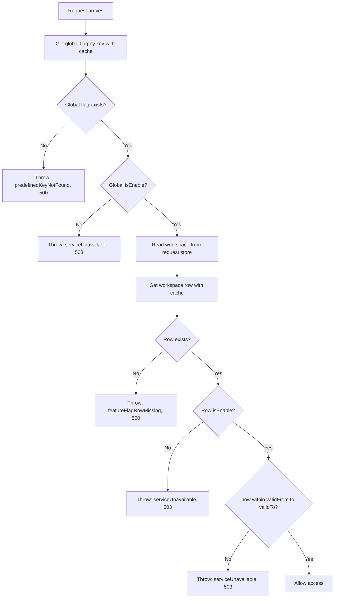

# Workspace Feature Flag

Status: proposed. Nothing in this document is implemented yet.

## Overview

A workspace feature flag lets the platform switch a feature on or off for one workspace, optionally within a validity window, and override individual feature settings per workspace, each with a window of its own. It sits beside the global [Feature Flag][ref-doc-feature-flag] and does not replace it.

Goals:

1. Each workspace has its own configuration per feature, with an optional `validFrom` and `validTo` on the feature and on each configuration entry.
2. The platform can disable a feature for every workspace at once.
3. A guard blocks a request when the active workspace does not have the feature enabled.

Access:

- Every member of a workspace can read that workspace's flags.
- Only a platform admin can change them.

## Related Documents

- [Feature Flag][ref-doc-feature-flag] - the global catalog this feature builds on
- [Workspace][ref-doc-workspace] - the tenancy boundary and the `x-workspace-id` selection
- [Database][ref-doc-database] - Prisma conventions and seeding
- [Activity Log][ref-doc-activity-log] - action contracts
- [Status Codes][ref-doc-status-codes] - the `workspace` block

## Table of Contents

- [Decisions](#decisions)
- [Data Model](#data-model)
- [Feature Registry](#feature-registry)
- [Evaluation](#evaluation)
- [Guard and Decorator](#guard-and-decorator)
- [Cache](#cache)
- [Lifecycle](#lifecycle)
- [API](#api)
- [Activity Log](#activity-log)
- [Status Codes](#status-codes)
- [Future: Default Values](#future-default-values)
- [Open Questions](#open-questions)
- [Implementation Steps](#implementation-steps)

## Decisions

### Part of the workspace module

The feature lives inside `src/modules/workspace`, in the same layout the module already uses: `workspace.feature-flag.domain.ts`, `workspace.feature-flag.repository.ts`, a guard, a decorator, and controller routes. It depends on the workspace and cannot exist without one, so it does not get its own module.

- `FeatureFlag` stays the global catalog: key, description, the platform kill switch (`isEnable`), rollout, and the metadata keys with their catalog values. Requirement 2 is already met by `FeatureFlag.isEnable = false`, which returns 503 for every workspace. No new code is needed for it.
- The catalog stays workspace-agnostic. The workspace module already depends on `feature-flag` through `@FeatureFlagProtected('workspace')`, so `feature-flag` must not depend back.
- The workspace module reaches `FeatureFlagDomain` through its exported domain only, never its repository. It uses the catalog for the kill switch and reads nothing from `FeatureFlag.metadata`.

### Two levels: the feature and its configuration

Feature-level `isEnable` plus one window cannot express "this setting is 20 from March to June, then back to its default". A configuration entry needs a window of its own, so it cannot live inside a single `metadata` JSON on the feature row. It becomes its own row.

- `WorkspaceFeatureFlag`: the feature is on or off for this workspace, inside an optional window.
- `WorkspaceFeatureFlagConfig`: an override of one registry configuration key for this workspace, inside its own optional window.

### Why two storage shapes

The global catalog keeps its whole configuration set in one `metadata` JSON. The workspace side stores one row per configuration entry. Both stay, because they answer different questions.

| | Global `FeatureFlag.metadata` | `WorkspaceFeatureFlagConfig` |
|---|---|---|
| Scope | platform-wide | one workspace |
| Edited by | platform admin | platform admin |
| Window per entry | no | yes |
| Shape | one flat JSON blob | one row per key |

- Per-key rows in the catalog would rewrite a working module for no gain.
- One JSON blob per workspace, with `{ value, validFrom, validTo }` per key, loses the per-entry audit fields, the per-entry unique constraint, and safe partial updates: two admins editing different keys would overwrite each other.

The two are bridged by a registry in code, not by the catalog's JSON (see [Feature Registry](#feature-registry)). Global metadata such as `signUpAllowed` or `invitationAllowed` is untouched and stays platform-level.

### Eager feature rows, sparse configuration rows

- **Feature rows are eager.** Creating a workspace inserts one row per registry feature, using its `defaultEnable`. A missing row is a server misconfiguration and fails closed. The guard stays simple, at the cost of a backfill when a registry feature is added (see [Lifecycle](#lifecycle)).
- **Configuration rows are sparse.** A row exists only when an admin overrides a value. With no row, or outside its window, the effective value is the registry default. Adding a configuration key needs no backfill.

## Data Model

`WorkspaceFeatureFlag`, table `workspace_feature_flags`:

| Field | Type | Notes |
|---|---|---|
| `id` | uuid | `uuidv7()` default |
| `workspaceId` | uuid | FK to `Workspace`, `onDelete: Cascade` |
| `featureFlagId` | uuid | FK to `FeatureFlag`, `onDelete: Cascade` |
| `isEnable` | boolean | default `true` |
| `validFrom` | datetime, nullable | inclusive start |
| `validTo` | datetime, nullable | exclusive end |
| `createdAt`, `createdBy`, `updatedAt`, `updatedBy` | | audit fields |

- `@@unique([workspaceId, featureFlagId])`, `@@index([featureFlagId])`

`WorkspaceFeatureFlagConfig`, table `workspace_feature_flag_configs`:

| Field | Type | Notes |
|---|---|---|
| `id` | uuid | `uuidv7()` default |
| `workspaceFeatureFlagId` | uuid | FK to `WorkspaceFeatureFlag`, `onDelete: Cascade` |
| `key` | string | a configuration key declared in the registry for this feature |
| `value` | json | validated by the registry's zod schema for that key |
| `validFrom` | datetime, nullable | inclusive start |
| `validTo` | datetime, nullable | exclusive end |
| audit fields | | as above |

- `@@unique([workspaceFeatureFlagId, key])`. One override per key. Successive time-boxed values for the same key are an open question.

Rules that apply to both tables:

- When both dates are set, `validTo` must be later than `validFrom`. Validated in the request schema and the domain.
- Both null means always valid. One null means open-ended on that side.
- The window is half-open, `[validFrom, validTo)`, compared in UTC.
- A configuration `key` must be declared in the registry for its feature, and `value` must pass that key's zod schema. The registry freezes the keys.
- Soft-deleting a workspace keeps its rows. Rows go only when the workspace is hard-deleted.

## Feature Registry

The registry is the static list of workspace-tunable features. It maps each unique feature key to its description, its default enablement, and the configuration keys it offers, each with a zod schema and a default. It lives in `constants/workspace.feature-flag.constant.ts`.

```typescript
export const WorkspaceFeatureRegistry = {
    project: {
        description: 'Project management inside a workspace',
        defaultEnable: true,
        configs: {
            maxProjects: { schema: z.number().int().positive(), default: 10 },
            allowGuests: { schema: z.boolean(), default: false },
        },
    },
} as const satisfies Record<string, IWorkspaceFeatureDefinition>;
```

- The feature key and the configuration keys are types derived from the registry. `@WorkspaceFeatureFlagProtected('projct')` fails at compile time. The guard still checks the key at runtime and rejects an unknown one with 500.
- The zod schema validates every admin write and every read of a stored value.
- Every registry feature key must also exist as a global `FeatureFlag` row, because the global row is the kill switch. A boot check, and the seed, assert it. There is no foreign key from configuration rows to the catalog.
- The registry supplies the default set for workspace creation (`defaultEnable`) and the default value for every configuration key.
- Feature and configuration keys are camelCase, following the same rule as global flag keys.

## Evaluation

### Feature



- The global kill switch outranks any workspace row, including one that is enabled and inside its window.
- The global `rolloutPercent` and `targetUserIds` are not applied per workspace. Tenant entitlement is the row. A flag is never an authorization boundary (see [Feature Flag][ref-doc-feature-flag]).
- The time check runs on every request against the current time. A cached row never caches a verdict.

### Configuration value

A configuration value is read only after the feature check above passes.

1. Find the override for `key` on the workspace's row.
2. If it exists and `now` is inside its window, its `value` wins.
3. Otherwise the registry default for `key` is the effective value.

A stored value that no longer passes its schema (the schema was tightened after the write) is logged and treated as absent, so the registry default applies.

The two windows mean different things. An expired feature window switches the feature off. An expired configuration window ends the override and the default applies again.

A configuration key used as a gate follows the global rule: the effective value must be boolean, a non-boolean is 500 (`predefinedKeyTypeInvalid`), and `false` is 503 (`serviceUnavailable`). A registry key typed `z.boolean()` cannot hit the 500. It is asserted in the owning domain through `validateWorkspaceFeatureFlagConfig(workspaceId, key, configKey)`, never in the decorator.

## Guard and Decorator

`@WorkspaceFeatureFlagProtected('<key>')` takes a bare flag key. A dotted key, or an empty segment, is rejected the same way `@FeatureFlagProtected` rejects it. The decorator lives in `workspace.decorator.ts`, the guard in `guards/`.

The guard checks the global flag first, then the workspace row, so a route needs one decorator, not two.

```typescript
@Response('project.list')
@WorkspaceFeatureFlagProtected('project')
@WorkspaceProtected()
@UserProtected()
@ApiKeyProtected()
@Get('/list')
async list(): Promise<IResponsePaginationReturn<ProjectResponseDto>> { ... }
```

Position matters. `@WorkspaceFeatureFlagProtected()` sits above `@WorkspaceProtected()`. Decorators run bottom-up, and the guard needs the workspace that `WorkspaceGuard` stores in the request store. Without that order the guard finds no workspace.

The `/admin` scope takes no workspace guard, so it takes no workspace flag either.

## Cache

- Key: `WorkspaceFeatureFlag:{workspaceId}:{key}`, TTL 1 hour, configured in `workspace.config.ts`. The cached value is the feature row with its configuration rows.
- Read-through and best-effort: a cache failure is logged and falls through to the database.
- An admin update to the row or to any of its configuration entries deletes the entry.
- The cache holds raw dates. The window checks are never cached.

## Lifecycle

### Workspace creation

`WorkspaceDomain.createInTx` inserts the default feature rows in the same transaction as the workspace. Every creation path (personal workspace on sign-up, user-created workspace, admin onboarding) goes through it, so there is one hook. A workspace never exists without its rows.

The rows come from the registry: one per feature, with `isEnable` set from `defaultEnable`. No configuration rows are created.

### Adding a registry feature

Adding a feature to the registry requires, in the same change:

1. A global `FeatureFlag` seed row for the same key.
2. A backfill seed that inserts one row per existing workspace, skipping duplicates, with a matching `remove()`.

Skipping either leaves existing workspaces without a row, and the guard fails closed with 500 on those routes.

### Adding a configuration key

Registry edit only. With no override row, the registry default applies.

### Removing a configuration key

A registry edit plus a seed that deletes the orphan override rows. Until the seed runs, reads ignore rows whose key is not in the registry.

## API

User scope, gated by `@FeatureFlagProtected('workspace')` like the other user routes, and open to any member of the active workspace:

| Method | Path | Purpose |
|---|---|---|
| GET | `/user/workspace/feature-flag` | list the active workspace's flags with the effective state and configuration |

The response carries, per flag: key, description, `isEnable`, the window, whether the flag is currently effective, and its configuration entries with their windows and effective values.

Admin scope, workspace addressed by path because the admin scope has no `x-workspace-id`:

| Method | Path | Purpose |
|---|---|---|
| GET | `/admin/workspace/:workspaceId/feature-flag` | list a workspace's flags |
| PATCH | `/admin/workspace/:workspaceId/feature-flag/:featureFlagId` | update `isEnable`, `validFrom`, `validTo` |
| PUT | `/admin/workspace/:workspaceId/feature-flag/:featureFlagId/config/:key` | set or replace one override: `value`, `validFrom`, `validTo` |
| DELETE | `/admin/workspace/:workspaceId/feature-flag/:featureFlagId/config/:key` | remove an override so the catalog value applies |

There is no create or delete endpoint for feature rows. They are system-managed.

Every write deletes the cache entry.

## Activity Log

The user read route writes no activity. The admin writes add two actions to `EnumActivityLogAction`, named like the other platform-admin actions (`admin<Subject><Verb>`, contract `user: payload`):

| Action | Written by | Metadata |
|---|---|---|
| `adminWorkspaceFeatureFlagUpdate` | PATCH on a feature row | flag key, resulting `isEnable`, `validFrom`, `validTo` |
| `adminWorkspaceFeatureFlagConfigUpdate` | PUT or DELETE on an override | flag key, config key, value, `validFrom`, `validTo`, and whether it was removed |

The contract sets `workspace: target` so the row shows in the affected workspace's activity list. Every existing `admin*` action uses `workspace: none`, so this is the first admin action with a workspace target. Confirm during implementation that `prepare` and the list routes accept `user: payload` together with `workspace: target`. The metadata schema and the i18n description in `src/languages/en/activityLog.json` are added with the action, and both actions are recorded in [Activity Log][ref-doc-activity-log].

## Status Codes

The feature extends the `workspace` block, which currently ends at `51620`. New members take the next numbers:

| member | statusCode | httpStatus | messagePath | description |
|---|---|---|---|---|
| `featureFlagNotFound` | `51621` | 404 | `workspace.error.featureFlagNotFound` | Sorry, we couldn't find that workspace feature flag. |
| `featureFlagRowMissing` | `51622` | 500 | `workspace.error.featureFlagRowMissing` | The workspace has no row for this feature flag. |
| `featureFlagWindowInvalid` | `51623` | 400 | `workspace.error.featureFlagWindowInvalid` | The validity window must end after it starts. |
| `featureFlagConfigInvalid` | `51624` | 400 | `workspace.error.featureFlagConfigInvalid` | The configuration key is unknown or its value is invalid. |

The workspace block becomes `51600`–`51624` (25 members), and the block map and the `workspace` table in [Status Codes][ref-doc-status-codes] are updated with it.

Reused from `feature-flag`, because they already mean the same thing: `serviceUnavailable` (`50601`, 503) for a disabled feature, an expired or not-yet-started window, and a `false` gate; `predefinedKeyNotFound` (`50606`), `predefinedKeyEmpty` (`50604`), `predefinedKeyLengthExceeded` (`50603`), `predefinedKeyTypeInvalid` (`50605`) for the key checks. `featureFlagConfigInvalid` covers an override whose key is not in the registry or whose value fails its schema.

`featureFlagNotFound` covers an unknown `featureFlagId` on the admin path. `featureFlagRowMissing` is the guard's fail-closed case, kept apart because it is a server misconfiguration, not a client error.

## Future: Default Values

The registry default already acts as the per-key default, and an override row replaces it inside its window. A per-feature default for `isEnable` and the window is the remaining gap. If it lands, feature rows can also become sparse, since a missing row could inherit a real default instead of failing closed.

## Open Questions

1. Which features are in the first registry, and with which configuration keys? `workspace`, `loginWith*` and `signUp` are platform concerns and likely stay out of it.
2. Can one configuration key hold several time-boxed values (a schedule), or one override at a time? The unique key above allows one. A schedule needs `@@unique([workspaceFeatureFlagId, key, validFrom])` and a non-overlap rule.
3. An expired window answers 503 with no notification or activity row. Assumed enough; revisit if tenants need a warning before expiry.

## Implementation Steps

Test-first, in this order:

1. Schema: the two models, relations on `Workspace` and `FeatureFlag`, and the two new `EnumActivityLogAction` members. The owner applies it to the database.
2. Registry, its definition interface, and the boot check that every registry key has a global `FeatureFlag` row.
3. Repository and interfaces in the workspace module: `WorkspaceFeatureFlagRepository` owns both models, the configuration table being its satellite. Includes `createDefaultsInTx` and the bulk backfill insert.
4. Domain: `validateWorkspaceFeatureFlag`, `validateWorkspaceFeatureFlagConfig`, list, update, override set and remove.
5. Cache and config keys.
6. Exceptions, the three status codes, and i18n messages.
7. Guard and `@WorkspaceFeatureFlagProtected`.
8. Hook into `WorkspaceDomain.createInTx`.
9. Backfill seed for existing workspaces.
10. Activity-log contracts and descriptions.
11. User and admin controller routes, DTOs, and HTTP service.
12. Update [Feature Flag][ref-doc-feature-flag], [Workspace][ref-doc-workspace], [Activity Log][ref-doc-activity-log], and [Status Codes][ref-doc-status-codes] to describe the final state.

<!-- REFERENCES -->

[ref-doc-feature-flag]: ../feature-flag.md
[ref-doc-workspace]: ../workspace.md
[ref-doc-database]: ../database.md
[ref-doc-activity-log]: ../activity-log.md
[ref-doc-status-codes]: ../status-codes.md
