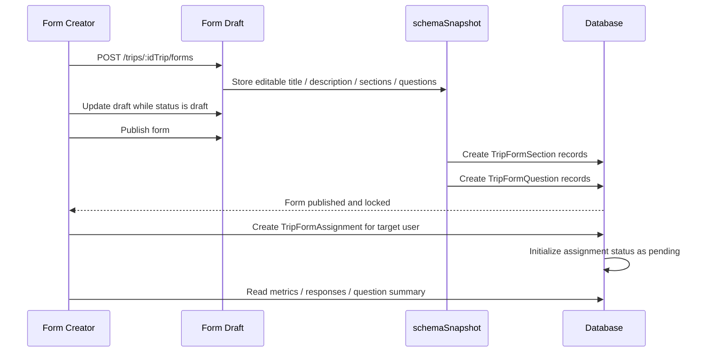
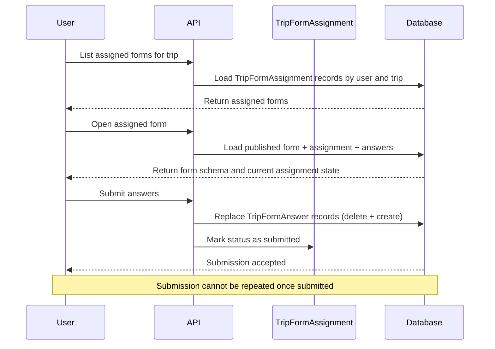

# Trip Form Documentation

This documentation explains the features and usage of **Trip Form Module**: Located at `src/modules/trip-form`

## Overview

Trip Form Module provides a structured way for backend users to create trip-specific form instances, publish them, assign them to users, and collect final submissions.

This feature was previously referred to as **survey** in the documentation. The current implementation supports multiple form kinds (survey, form, poll), and forms are now explicitly trip-scoped through the `TripForm` model.

At a high level, the feature works in four stages:

- **Draft stage**: the form definition is prepared through `schemaSnapshot`
- **Publish stage**: the snapshot is materialized into stored sections and questions
- **Assignment stage**: published forms are assigned to users
- **Submission stage**: assigned users submit final answers

This module is designed so form structure is flexible while being drafted, but immutable once it is published. Assignment and answer records are handled separately from the draft schema.

## Related Documents

- [Authentication Documentation][ref-doc-authentication] - For JWT and API key requirements
- [Authorization Documentation][ref-doc-authorization] - For admin and user access control
- [Activity Log Documentation][ref-doc-activity-log] - For create/publish/archive/delete activity recording
- [Term Policy Documentation][ref-doc-term-policy] - For user access requirements before submitting forms
- [Response Documentation][ref-doc-response] - For standardized API response format
- [Trip Form Integration](ideas/trip/trip-form.md) - For direct trip ownership model and workflow

## Table of Contents

- [Overview](#overview)
- [Related Documents](#related-documents)
- [Form Concept](#form-concept)
- [Trip Ownership](#trip-ownership)
- [Form Lifecycle](#form-lifecycle)
    - [Draft Stage](#draft-stage)
    - [Publish Stage](#publish-stage)
    - [Assignment Stage](#assignment-stage)
    - [Submission Stage](#submission-stage)
- [Schema Snapshot](#schema-snapshot)
- [Routes Overview](#routes-overview)
    - [Admin / Shared Routes](#admin--shared-routes)
    - [User Routes](#user-routes)
- [Trip Integration](#trip-integration)
- [Flow](#flow)
    - [Admin Flow Diagram](#admin-flow-diagram)
    - [User Flow Diagram](#user-flow-diagram)
- [Important Rules](#important-rules)
- [Known Limitations](#known-limitations)
- [Contribution](#contribution)

## Form Concept

The trip form feature is built for cases where authenticated users need to define a structured questionnaire tied to a specific trip, publish it, assign it to specific users, and collect one final submission per assignment.

A trip form contains:

- form metadata such as kind, title, and description
- a form schema made of sections and questions
- assignment records defining which users must answer the form
- assignment submission state (`status`, `submittedAt`) and answer records

Supported form kinds are currently:

- `survey`
- `form`
- `poll`

The important design decision is that the editable form definition lives first as a **snapshot of the schema**, not as assignment/answer records.

## Trip Ownership

Each `TripForm` belongs to exactly one trip and cannot be shared across trips.

Current ownership model:

- `TripForm.tripId` is required
- `Trip` exposes `forms TripForm[]`
- `TripFormAssignment` is the per-user delivery record for a trip-owned form

This keeps ownership simple:

- a trip owns many forms
- a form belongs to one trip
- assignments target individual users for that trip-owned form

If another trip needs the same questionnaire, the backend creates a new copied `TripForm` row for that trip. Cross-trip reuse should happen by cloning (via `POST /trips/:idTrip/forms/from-template`), not by sharing one live form record across multiple trips.

## Form Lifecycle

### Draft Stage

Before a form is published, the backend user works on the form as a draft.

During this stage:

- the form definition is stored in `schemaSnapshot`
- the structure can still be adjusted
- the form status is `draft`
- the form is not yet active for end users
- assignments are not created yet

This draft stage is where the form creator finalizes:

- kind
- title
- description
- sections
- questions
- closes date at form level

### Publish Stage

When the form creator decides to publish the form, the draft is finalized.

At publish time:

- `schemaSnapshot` is treated as the source of truth for the current form definition
- the publish operation materializes the snapshot into `TripFormSection` records
- the publish operation materializes the snapshot into `TripFormQuestion` records
- published `TripFormSection.id` and `TripFormQuestion.id` become the identifiers used by published read APIs, submissions, and summaries
- the form status becomes `published`
- `publishedAt` is set

After this point, the form is considered **locked**:

- the draft can no longer be updated
- the question structure can no longer be changed through draft endpoints
- users can only interact with the published structure

This rule exists to preserve consistency between:

- what admins published
- what users see
- what assignment states and answers refer to

### Assignment Stage

Assignments are created only after the form is published.

When a form creator creates an assignment:

- a `TripFormAssignment` record is created targeting the user identified by `userId`, which must reference a valid `User` record
- assignment-specific scheduling can be stored through `startsAt` and `closesAt`
- assignment `status` is initialized to `pending`
- `submittedAt` remains `null` until submission

This means the recipient list is no longer part of the draft schema. It is managed as separate assignment data after publication.

### Submission Stage

Once a form is published and assigned, the user can open the form and submit answers.

When a user submits:

- the system loads the assignment through the provided `assignmentId`
- the assignment must exist and be active
- the form must still be `published`
- the form-level and assignment-level close dates must not be exceeded
- existing answers for the assignment are deleted and replaced (`deleteMany` + `createMany`) using `assignmentId` and published `questionId` values (`TripFormQuestion.id`)
- the assignment is marked as `submitted`
- `submittedAt` is set

After submission:

- the same assignment cannot be submitted again
- the submission is treated as final

This guarantees one final submitted state per assignment.

## Schema Snapshot

`schemaSnapshot` is the core of the form draft workflow.

It represents the editable form definition before publication, including:

- form title
- form description
- form sections
- form questions and their configuration

Question definitions currently support:

- `text`
- `number`
- `singleSelect`
- `multiSelect`
- `boolean`
- `date`

The question summary endpoint (`GET /trips/:idTrip/forms/:idForm/questions/:questionId/summary`) aggregates stored answers differently per type:

- `singleSelect` / `multiSelect` - counts occurrences of each option value (frequency breakdown)
- `boolean` - counts `true` and `false` responses separately
- `number` - returns `min`, `max`, `avg`, and total response count
- `text` / `date` - returns only the count of non-null responses; individual values are not surfaced

Conceptually, `schemaSnapshot` is the editable blueprint for one trip-owned form instance. Once the form is published, that snapshot is materialized into persistent `TripFormSection` and `TripFormQuestion` records used by the published form.

Post-publish endpoints (`GET .../questions/:questionId/summary` and answer submission) use the published `TripFormQuestion.id` ObjectId.

In short:

- **before publish**: `schemaSnapshot` acts as the draft
- **on publish**: `schemaSnapshot` is materialized into sections and questions
- **after publish**: assignments and answers operate on the published form

## Routes Overview

### Admin / Shared Routes

Authenticated users manage trip forms through shared routes under `/trips/:idTrip/forms`.

These endpoints come from `TripFormSharedController`, which is mounted through `RoutesSharedModule`.

These routes have no role restriction, but they do require valid JWT + API key + enabled `trip` feature flag + active user checks.

Trip form creation and management:

- `POST /trips/:idTrip/forms` - create a new draft form for a trip
- `POST /trips/:idTrip/forms/from-template` - create a new form by cloning from a `TenantFormTemplate`

Existing runtime form operations:

- `GET /trips/:idTrip/forms` - list forms for trip with status and kind filters
- `GET /trips/:idTrip/forms/:idForm` - get one form
- `PATCH /trips/:idTrip/forms/:idForm` - update draft
- `PATCH /trips/:idTrip/forms/:idForm/publish` - publish draft
- `POST /trips/:idTrip/forms/:idForm/assignments` - assign published form to a user
- `PATCH /trips/:idTrip/forms/:idForm/archive` - archive published form
- `DELETE /trips/:idTrip/forms/:idForm` - delete form
- `GET /trips/:idTrip/forms/:idForm/metrics` - get assignment and submission metrics (`assignedCount`, `pendingCount`, `submittedCount`, `completionRate`)
- `GET /trips/:idTrip/forms/:idForm/responses` - list assignment status and answers for a form
- `GET /trips/:idTrip/forms/:idForm/questions/:questionId/summary` - aggregate answers for one question

### User Routes

Users access assigned forms through `/trips/:idTrip/forms`.

These endpoints come from `TripFormUserController`, which is mounted through `RoutesUserModule`.

The user-facing read and submit endpoints are assignment-scoped. `assignmentId` is part of the path because the resource being accessed is a specific form assignment, not just the form definition.

Available operations:

- `GET /trips/:idTrip/forms` - list assigned forms for trip with optional assignment status filter
- `GET /trips/:idTrip/forms/:idForm/assignments/:assignmentId` - get one published form plus the user's assignment state and answers
- `POST /trips/:idTrip/forms/:idForm/assignments/:assignmentId/submit` - submit answers for an assignment

User routes require accepted term policies before access.

## Trip Integration

Trip integration is direct, not bridge-based.

Current model:

- `TripForm.tripId` is the direct relation to `Trip`
- the form creation route (`POST /trips/:idTrip/forms`) is trip-scoped in the route itself
- form ownership is enforced by trip-scoped queries
- `/trips/:idTrip/forms` user routes are trip-scoped

This is intentionally simpler than introducing a separate bridge model when the product does not require many-to-many reuse.

`TripFormAssignment` still matters in this model:

- `Trip` tells you the owner scope
- `TripForm` tells you the questionnaire definition
- `TripFormAssignment` tells you which user must answer it and on what schedule
- `TripFormAnswer` stores submitted values keyed by `assignmentId` and `questionId`

## Flow

### Admin Flow Diagram

### User Flow Diagram

## Important Rules

- A form starts as a draft through `schemaSnapshot`
- Each form belongs to exactly one trip
- Drafts can only be updated while status is `draft`
- Publishing materializes the draft into `TripFormSection` and `TripFormQuestion`
- Assignments are created only after the form is published
- Each assignment starts with `status = pending` and `submittedAt = null`
- Users can submit only for an active assignment
- Submission is blocked if the assignment has not yet opened (`startsAt`) or is closed (`closesAt`)
- Form visibility and submission are blocked before assignment `startsAt` is reached
- Once an assignment is submitted, it cannot be submitted again
- Forms can be archived only after publication
- If another trip needs the same questionnaire, create a copied new `TripForm` row or clone from a `TenantFormTemplate`

## Known Limitations

The following are current limitations of the trip form module as implemented. They are not bugs but deliberate scope decisions or deferred features.

### Assignment targeting is user-only

`TripFormAssignment` targets a single user via `userId`. Group, team, or role-based targeting is not supported. Every assignment must reference a single `User` record.

### No bulk assignment

There is no API to assign a form to multiple users at once. Assignments must be created one at a time.

### No assignment deactivation

The `isActive` field exists on `TripFormAssignment` in the schema but there is no endpoint to deactivate or reactivate an assignment after it has been created.

### `startsAt` enforcement

Assignment `startsAt` is enforced on all user-facing endpoints. Users cannot view or submit a form before `startsAt` is reached. The form list also filters out assignments whose time window is not yet open.

### Text and date question summaries return count only

The question summary endpoint does not surface individual text or date answer values. For `text` and `date` question types it returns only the count of non-null responses, not the actual submitted values.

### No form versioning

Updating a draft overwrites the existing `schemaSnapshot` in place. There is no history of previous draft states, and no way to restore a prior version of the schema.

### No role restriction on shared routes

The shared routes do not enforce role-based restrictions. Any authenticated active user with valid JWT + API key and enabled `trip` feature flag can create, update, publish, archive, and delete forms. Role-based access control at the form management level must be handled externally if required.

<!-- REFERENCES -->

[ref-doc-authentication]: authentication.md
[ref-doc-authorization]: authorization.md
[ref-doc-activity-log]: activity-log.md
[ref-doc-term-policy]: term-policy.md
[ref-doc-response]: response.md
