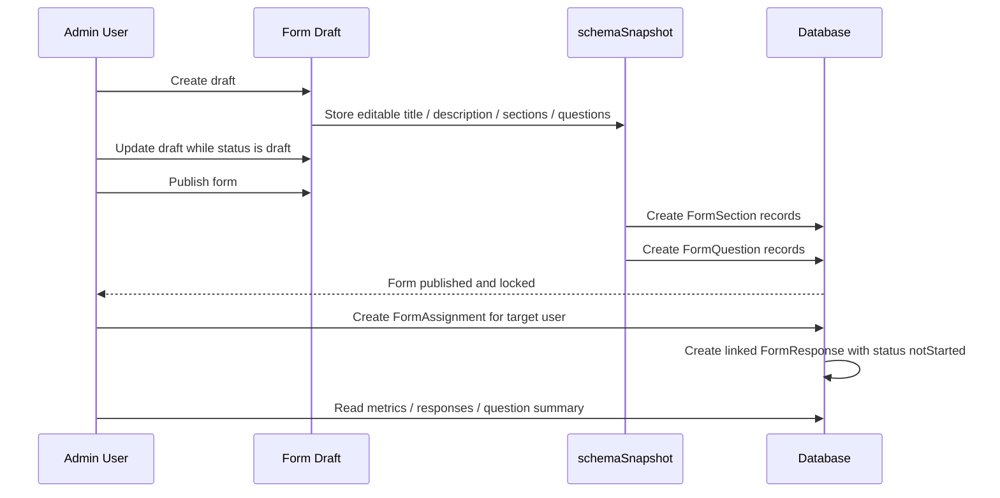
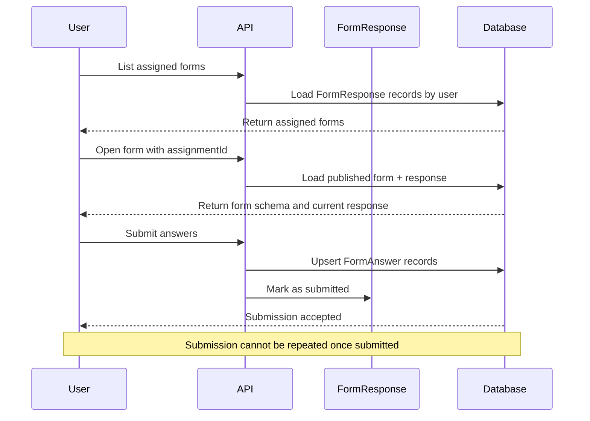

# Form Documentation

This documentation explains the features and usage of **Form Module**: Located at `src/modules/form`

## Overview

Form Module provides a structured way for backend users to create reusable questionnaires, publish them, assign them to users, and collect final responses.

This feature was previously referred to as **survey** in the documentation. The current implementation is now the generic `form` module, where `survey` is only one supported value of `EnumFormKind`.

At a high level, the feature works in four stages:

- **Draft stage**: the form definition is prepared through `schemaSnapshot`
- **Publish stage**: the snapshot is materialized into stored sections and questions
- **Assignment stage**: published forms are assigned to users
- **Submission stage**: assigned users submit final answers

This module is designed so form structure is flexible while being drafted, but immutable once it is published. Assignment and response records are handled separately from the draft schema.

## Related Documents

- [Authentication Documentation][ref-doc-authentication] - For JWT and API key requirements
- [Authorization Documentation][ref-doc-authorization] - For admin and user access control
- [Activity Log Documentation][ref-doc-activity-log] - For create/publish/archive/delete activity recording
- [Term Policy Documentation][ref-doc-term-policy] - For user access requirements before submitting forms
- [Response Documentation][ref-doc-response] - For standardized API response format

## Table of Contents

- [Overview](#overview)
- [Related Documents](#related-documents)
- [Form Concept](#form-concept)
- [Form Lifecycle](#form-lifecycle)
  - [Draft Stage](#draft-stage)
  - [Publish Stage](#publish-stage)
  - [Assignment Stage](#assignment-stage)
  - [Submission Stage](#submission-stage)
- [Schema Snapshot](#schema-snapshot)
- [Routes Overview](#routes-overview)
  - [Admin / Shared Routes](#admin--shared-routes)
  - [User Routes](#user-routes)
- [Flow](#flow)
  - [Admin Flow Diagram](#admin-flow-diagram)
  - [User Flow Diagram](#user-flow-diagram)
- [Important Rules](#important-rules)
- [Contribution](#contribution)

## Form Concept

The form feature is built for cases where the backend team needs to define a structured questionnaire, publish it, assign it to specific users, and collect one final response per assignment.

A form contains:

- form metadata such as kind, title, and description
- a form schema made of sections and questions
- assignment records defining which users must answer the form
- response records storing submission status and answers

Supported form kinds are currently:

- `survey`
- `form`
- `poll`

The important design decision is that the editable form definition lives first as a **snapshot of the schema**, not as assignment or response records.

## Form Lifecycle

### Draft Stage

Before a form is published, the backend user works on the form as a draft.

During this stage:

- the form definition is stored in `schemaSnapshot`
- the structure can still be adjusted
- the form status is `draft`
- the form is not yet active for end users
- assignments are not created yet

This draft stage is where the backend user finalizes:

- kind
- title
- description
- sections
- questions
- closes date at form level

### Publish Stage

When the backend user decides to publish the form, the draft is finalized.

At publish time:

- `schemaSnapshot` is treated as the source of truth for the current form definition
- the publish operation materializes the snapshot into `FormSection` records
- the publish operation materializes the snapshot into `FormQuestion` records
- the form status becomes `published`
- `publishedAt` is set

After this point, the form is considered **locked**:

- the draft can no longer be updated
- the question structure can no longer be changed through draft endpoints
- users can only interact with the published structure

This rule exists to preserve consistency between:

- what admins published
- what users see
- what responses refer to

### Assignment Stage

Assignments are created only after the form is published.

When an admin creates an assignment:

- a `FormAssignment` record is created for the target user
- assignment-specific scheduling can be stored through `startsAt` and `closesAt`
- a linked `FormResponse` record is created immediately
- the initial response status is `notStarted`

This means the recipient list is no longer part of the draft schema. It is managed as separate assignment data after publication.

### Submission Stage

Once a form is published and assigned, the user can open the form and submit answers.

When a user submits:

- the system loads the response through the provided `assignmentId`
- the assignment must exist and be active
- the form must still be `published`
- the form-level and assignment-level close dates must not be exceeded
- answers are upserted into `FormAnswer`
- the response is marked as `submitted`
- `submittedAt` is set

After submission:

- the same response cannot be submitted again
- the submission is treated as final

This guarantees that each assignment has one final submitted response.

## Schema Snapshot

`schemaSnapshot` is the core of the form draft workflow.

It represents the editable form definition before publication, including:

- form title
- form description
- form sections
- form questions and their configuration

Question definitions currently support:

- `text`
- `number`
- `singleSelect`
- `multiSelect`
- `boolean`
- `date`

Conceptually, `schemaSnapshot` is the editable blueprint. Once the form is published, that snapshot is materialized into persistent `FormSection` and `FormQuestion` records used by the published form.

In short:

- **before publish**: `schemaSnapshot` acts as the draft
- **on publish**: `schemaSnapshot` is materialized into sections and questions
- **after publish**: assignments and responses operate on the published form

## Routes Overview

### Admin / Shared Routes

Admins manage forms through shared routes under `/forms`.

Available operations:

- `POST /forms` - create draft
- `GET /forms` - list owned forms with status and kind filters
- `GET /forms/:idForm` - get one form
- `PATCH /forms/:idForm` - update draft
- `POST /forms/:idForm/publish` - publish draft
- `POST /forms/:idForm/assignments` - assign a published form to a user
- `POST /forms/:idForm/archive` - archive published form
- `DELETE /forms/:idForm` - delete form
- `GET /forms/:idForm/metrics` - get assignment and submission metrics
- `GET /forms/:idForm/responses` - list responses for a form
- `GET /forms/:idForm/questions/:questionId/summary` - aggregate answers for one question

### User Routes

Users access assigned forms through the same `/forms` base path.

Available operations:

- `GET /forms` - list assigned responses with optional status filter
- `GET /forms/:idForm?assignmentId=...` - get one published form plus the user's response record
- `POST /forms/:idForm/submit` - submit answers for an assignment

User routes require accepted term policies before access.

## Flow

### Admin Flow Diagram

### User Flow Diagram

## Important Rules

- A form starts as a draft through `schemaSnapshot`
- Drafts can only be updated while status is `draft`
- Publishing materializes the draft into `FormSection` and `FormQuestion`
- Assignments are created only after the form is published
- Each assignment creates one linked `FormResponse`
- Users can submit only for an active assignment
- Submission is blocked if the assignment or form is closed
- Once a response is submitted, it cannot be submitted again
- Forms can be archived only after publication

## Contribution

When extending this module:

1. Keep the draft, publish, assignment, and submission lifecycle explicit in both code and documentation.
2. Preserve the separation between `schemaSnapshot`, published schema records, assignments, and responses unless the product requirements change deliberately.
3. Preserve the final-submission rule unless a formal answer revision workflow is introduced.
4. If the lifecycle changes, update this document first so the feature contract stays clear.

<!-- REFERENCES -->

[ref-doc-authentication]: authentication.md
[ref-doc-authorization]: authorization.md
[ref-doc-activity-log]: activity-log.md
[ref-doc-term-policy]: term-policy.md
[ref-doc-response]: response.md
