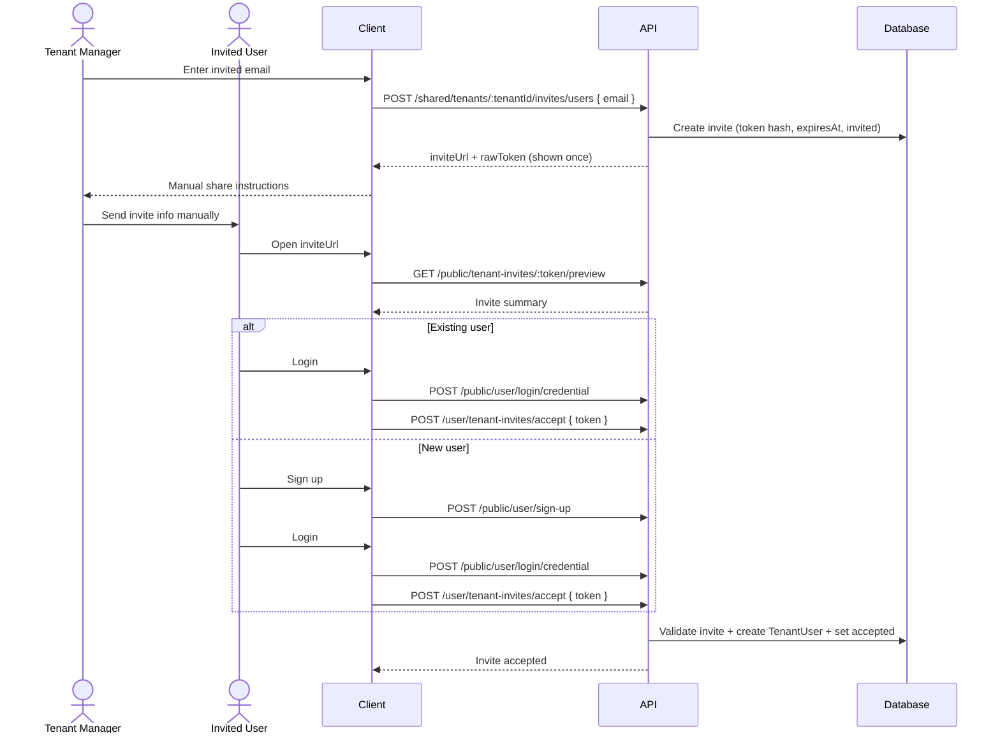

# Tenant Invite User Workflow

## Goal

Define how an existing tenant manager invites another user to co-manage the same tenant.

The invited person can be:

1. an already registered platform user
2. a new user who has never signed up

## Current Constraints

1. Tenant module is not implemented yet; this is a proposed workflow contract.
2. The invite endpoint accepts only `email` in the request body.
3. Email delivery is not available for now.
4. Because no email can be sent, the inviter must manually share invite information with the invited user.

## Proposed Domain Objects

1. `TenantUserInvite`
   - `id`
   - `tenantId`
   - `email` (normalized lower-case)
   - `tokenHash` (store hashed token only)
   - `status` (`invited`, `accepted`, `revoked`, `expired`)
   - `expiresAt`
   - `createdBy`
   - `acceptedByUserId` (nullable)
   - `createdAt`, `updatedAt`

2. `TenantUser`
   - membership row linking `tenantId` and `userId`
   - created only after invite acceptance

## High-Level Flow

1. Tenant manager calls invite endpoint with `email` only.
2. Backend creates invite and returns a one-time manual share payload.
3. Inviter manually sends invite link and details to the invited person (chat, phone, external email).
4. Invited person opens invite link.
5. If already registered: login, then accept invite.
6. If new: sign up, login, then accept invite.
7. Backend creates tenant membership and marks invite as accepted.

## Mermaid



## API Contract (Proposed)

### 1) Create invite (manager side)

`POST /shared/tenants/:tenantId/invites/users`

Request:

```json
{
  "email": "new.manager@example.com"
}
```

Rules:

1. `email` is required and normalized.
2. If there is an active pending invite for the same `(tenantId, email)`, return that invite or replace it (decision needed).
3. Raw invite token is generated, hashed for storage, and returned only once in this response.

Response example:

```json
{
  "id": "inv_123",
  "status": "invited",
  "expiresAt": "2026-05-01T00:00:00.000Z",
  "manualShare": {
    "inviteUrl": "https://app.example.com/join/tenant?token=raw_token",
    "token": "raw_token",
    "email": "new.manager@example.com"
  }
}
```

### 2) Preview invite (public)

`GET /public/tenant-invites/:token/preview`

Returns minimal safe information (tenant name, invite status, expiry). No sensitive tenant data.

### 3) Accept invite (authenticated user)

`POST /user/tenant-invites/accept`

Request:

```json
{
  "token": "raw_token"
}
```

Rules:

1. Invite must exist, be `invited`, and not be expired/revoked.
2. Logged-in user email must match invite email.
3. Accept is idempotent for the same user and invite.
4. On success, create `TenantUser (tenantId, userId)` if not exists, then set invite to `accepted`.

## Existing User vs New User

### Existing registered user

1. Receives manual invite link/token from tenant manager.
2. Logs in.
3. Accepts invite.
4. Becomes tenant manager/member in that tenant.

### New user never signed up

1. Receives manual invite link/token from tenant manager.
2. Signs up with the same email that was invited.
3. Logs in.
4. Accepts invite.
5. Becomes tenant manager/member in that tenant.

## Manual Sharing Requirement (No Email Service)

The manager UI should show a copy-ready message after invite creation, for example:

```text
You have been invited to manage tenant "Acme Travel".
Use this link: https://app.example.com/join/tenant?token=raw_token
If needed, token: raw_token
This invite expires on 2026-05-01 00:00:00 UTC.
Sign up or log in with this email: new.manager@example.com
```

## Validation and Safety

1. Rate-limit invite creation per tenant/user.
2. Never store raw token in DB, only hash.
3. Return raw token only on creation.
4. Mask invite existence errors in public preview/accept where possible.
5. Record activity logs for create, revoke, and accept.

## Open Decisions

1. Pending duplicate invite policy: return existing invite or rotate token and replace.
2. Invite expiration default (for example 7 days).
3. Role assignment at accept time: fixed default role or configurable later.
4. If signup requires email verification globally, define a temporary bypass/support process for this no-email phase.
