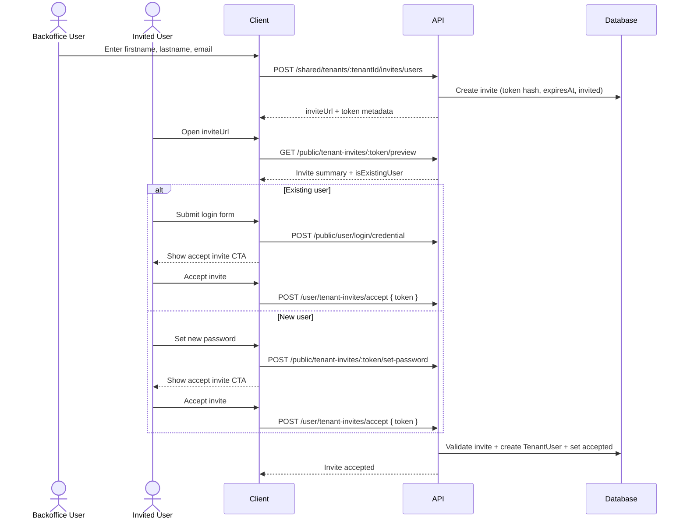

# Tenant Invite User Workflow

## Goal

Define how a backoffice user onboards another user into a tenant.

The backoffice inviter provides:

1. `firstname`
2. `lastname`
3. `email`

The invited person receives an invite link, opens it, and completes the onboarding flow based on whether the invited email already exists in the platform.

## Current Constraints

1. Tenant module is not implemented yet; this is a proposed workflow contract.
2. Invitation lifecycle and onboarding UX are defined here for backend/frontend alignment.

## Proposed Domain Objects

1. `TenantUserInvite`
   - `id`
   - `tenantId`
   - `firstname`
   - `lastname`
   - `email` (normalized lower-case)
   - `tokenHash` (store hashed token only)
   - `status` (`invited`, `accepted`, `revoked`, `expired`)
   - `expiresAt`
   - `createdBy`
   - `acceptedByUserId` (nullable)
   - `createdAt`, `updatedAt`

2. `TenantUser`
   - membership row linking `tenantId` and `userId`
   - created only after invite acceptance

## High-Level Flow

1. Backoffice user creates an invite with `firstname`, `lastname`, `email`.
2. Backend creates invite, generates one-time token, and issues invite link.
3. Invited user opens invite link.
4. Client calls preview endpoint: `GET /public/tenant-invites/:token/preview`.
5. Preview returns minimal tenant invite data plus whether the invited email already belongs to an existing user.
6. If user is new (`isExistingUser = false`): UI asks only for a new password.
7. If user exists (`isExistingUser = true`): UI asks user to log in.
8. After password setup/login succeeds, UI prompts user to accept invite.
9. Backend creates tenant membership and marks invite as accepted.

## Mermaid



## API Contract (Proposed)

### 1) Create invite (backoffice side)

`POST /shared/tenants/:tenantId/invites/users`

Request:

```json
{
  "firstname": "Jane",
  "lastname": "Doe",
  "email": "jane.doe@example.com"
}
```

Rules:

1. `firstname`, `lastname`, `email` are required.
2. `email` must be normalized and unique among active pending invites per `(tenantId, email)`.
3. Raw invite token is generated, hashed for storage, and returned only once in this response.

Response example:

```json
{
  "id": "inv_123",
  "status": "invited",
  "expiresAt": "2026-05-01T00:00:00.000Z",
  "inviteUrl": "https://app.example.com/join/tenant?token=raw_token"
}
```

### 2) Preview invite (public)

`GET /public/tenant-invites/:token/preview`

Returns minimal safe information for landing page rendering plus account-state routing.

Response example:

```json
{
  "invite": {
    "status": "invited",
    "expiresAt": "2026-05-01T00:00:00.000Z",
    "firstname": "Jane",
    "lastname": "Doe",
    "email": "jane.doe@example.com"
  },
  "tenant": {
    "id": "tenant_123",
    "name": "Acme Travel"
  },
  "isExistingUser": true
}
```

### 3) Set password for new invited user (public)

`POST /public/tenant-invites/:token/set-password`

Request:

```json
{
  "password": "StrongPassword123!"
}
```

Rules:

1. Invite must exist, be `invited`, and not be expired/revoked.
2. Allowed only when preview state is `isExistingUser = false`.
3. Creates or activates credential for the invited email.
4. Should establish authenticated session after success so user can immediately accept invite.

### 4) Accept invite (authenticated user)

`POST /user/tenant-invites/accept`

Request:

```json
{
  "token": "raw_token"
}
```

Rules:

1. Invite must exist, be `invited`, and not be expired/revoked.
2. Logged-in user email must match invite email.
3. Accept is idempotent for the same user and invite.
4. On success, create `TenantUser (tenantId, userId)` if not exists, then set invite to `accepted`.

## UX Decision Branch

### Existing user (`isExistingUser = true`)

1. User opens invite link.
2. Landing page shows minimal tenant context.
3. User is prompted to log in.
4. On successful login, user is prompted to accept invite.
5. User accepts invite and becomes tenant member.

### New user (`isExistingUser = false`)

1. User opens invite link.
2. Landing page shows minimal tenant context.
3. User is prompted only to set a new password.
4. After password setup, user is prompted to accept invite.
5. User accepts invite and becomes tenant member.

## Validation and Safety

1. Rate-limit invite creation per tenant/backoffice user.
2. Never store raw token in DB, only hash.
3. Return raw token only on creation.
4. Mask invite existence errors in public preview/accept where possible.
5. Record activity logs for create, revoke, password-setup, and accept.

## Open Decisions

1. Pending duplicate invite policy: return existing invite or rotate token and replace.
2. Invite expiration default (for example 7 days).
3. Role assignment at accept time: fixed default role or configurable later.
4. Behavior when existing user is already logged in while opening invite link.
5. Password policy and strength requirements for invite password setup.
