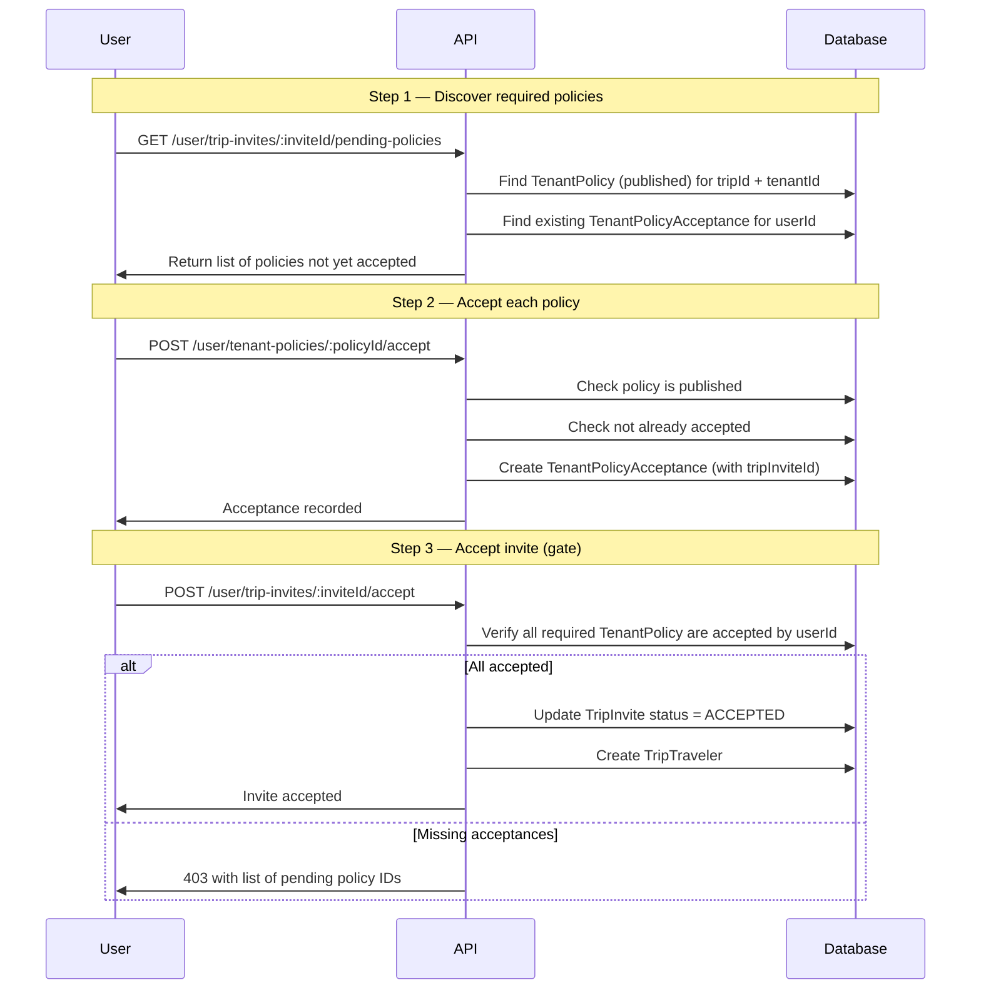

# Tenant Policy Implementation

## Scope

This file owns the Org-level legal document system:

1. `TenantPolicy` — draft/published legal documents owned by a Tenant
2. `TenantPolicyAcceptance` — per-user acceptance records for Tenant policies

Platform-level policies (managed by us) remain in the existing `TermPolicy` module and are **not changed** by this spec. The two systems are parallel and independent.

## Related Documents

1. Platform policy system: [docs/term-policy.md](/Users/loris.dantonio/ghq/github.com/Gzerox/ack-nestjs-boilerplate/docs/term-policy.md)
2. Trip aggregate: [docs/ideas/trip/trip.md](/Users/loris.dantonio/ghq/github.com/Gzerox/ack-nestjs-boilerplate/docs/ideas/trip/trip.md)
3. Trip traveler: [docs/ideas/trip/trip-traveler.md](/Users/loris.dantonio/ghq/github.com/Gzerox/ack-nestjs-boilerplate/docs/ideas/trip/trip-traveler.md)
4. Presign documentation: [docs/presign.md](/Users/loris.dantonio/ghq/github.com/Gzerox/ack-nestjs-boilerplate/docs/presign.md)
5. Database documentation: [docs/database.md](/Users/loris.dantonio/ghq/github.com/Gzerox/ack-nestjs-boilerplate/docs/database.md)

## Design Decision: Why Not Extend TermPolicy

The existing `TermPolicy` is intentionally kept **platform-only** for three reasons:

1. **Publishing semantics differ.** Platform publish resets `user.termPolicy[type]` flags for all users globally. Org publish must only invalidate acceptances within that Org, not globally.
2. **`user.termPolicy` boolean flags cannot scale.** Dynamic tenants cannot be represented as embedded static fields on the `User` model.
3. **Authorization domains are separate.** Platform policies are admin-managed; Org policies are managed per-tenant by Org admins.

## Enumerations

```text
TenantPolicyType:   termsOfService | privacy | marketing | cookies
TenantPolicyStatus: draft | published
```

`TenantPolicyType` intentionally mirrors `EnumTermPolicyType` from the platform module for consistency of UX across both systems.

## Prisma Draft Schema

```prisma
enum TenantPolicyType {
  termsOfService
  privacy
  marketing
  cookies
}

enum TenantPolicyStatus {
  draft
  published
}

type TenantPolicyContent {
  language   String   // ISO 639-1 language code, e.g. "en", "it"
  key        String   // S3 object key for the .hbs content file
}

model TenantPolicy {
  id          String                  @id @default(uuid())
  tenantId    String

  // null = Org-wide policy; set = Trip-specific policy
  tripId      String?

  type        TenantPolicyType
  version     Int                     @default(1)
  status      TenantPolicyStatus      @default(draft)
  contents    TenantPolicyContent[]

  publishedAt DateTime?
  createdAt   DateTime                @default(now())
  updatedAt   DateTime                @updatedAt
  createdBy   String?
  updatedBy   String?

  acceptances TenantPolicyAcceptance[]

  // One policy per (tenant, trip scope, type, version)
  @@unique([tenantId, tripId, type, version])
  @@index([tenantId, status])
  @@index([tripId, status])
  @@index([tenantId, type, status, publishedAt(sort: Desc)])
}

model TenantPolicyAcceptance {
  id               String        @id @default(uuid())
  userId           String

  tenantPolicyId   String
  tenantId         String        // denormalized for efficient scoped queries
  tripId           String?       // denormalized: mirrors tenantPolicy.tripId

  // Links acceptance to the TripInvite event that triggered it (nullable: future flows may accept without invite)
  tripInviteId     String?

  acceptedAt       DateTime      @default(now())
  createdAt        DateTime      @default(now())

  tenantPolicy     TenantPolicy  @relation(fields: [tenantPolicyId], references: [id])

  @@unique([userId, tenantPolicyId])
  @@index([userId, tenantId])
  @@index([userId, tripId])
  @@index([tenantPolicyId, acceptedAt(sort: Desc)])
}
```

## Entity Notes

1. `TenantPolicy.tripId = null` means the policy is Org-wide and applies to all trips in that tenant.
2. `TenantPolicy.tripId = <id>` means the policy is scoped to a specific trip only.
3. A trip may be covered by both Org-wide policies **and** trip-specific policies simultaneously.
4. `TenantPolicyContent` is an embedded type (not a relation); `key` is the S3 object key.
5. S3 content paths follow the same convention as `TermPolicy`: private bucket during draft, public bucket after publish.
6. `TenantPolicyAcceptance.tenantId` and `tripId` are denormalized for efficient index-only reads; they are never the source of truth.
7. `TenantPolicyAcceptance.tripInviteId` is nullable to allow future acceptance flows that are not invite-driven.
8. Publishing a `TenantPolicy` deletes all existing `TenantPolicyAcceptance` records for `(tenantId, type)` or `(tripId, type)`, forcing re-acceptance.
9. Once published, a `TenantPolicy` cannot be edited or deleted — only a new version (draft) can be created.

## Acceptance Flow

Acceptance is enforced **at `TripInvite` acceptance time only**. No runtime guard is applied to subsequent requests.



### Required Policies for a Trip

When evaluating which policies a user must accept before accepting a `TripInvite`:

1. Collect all **published** `TenantPolicy` records where `tenantId = trip.tenantId AND (tripId IS NULL OR tripId = trip.id)`.
2. For each, check if `TenantPolicyAcceptance` exists for `(userId, tenantPolicyId)`.
3. Missing acceptances block invite acceptance.

## Content Storage

S3 path conventions (mirrors `TermPolicy` pattern):

| Stage | Path |
|-------|------|
| Draft (private bucket) | `tenant-policy/{tenantId}/{type}/{version}/{language}.hbs` |
| Published (public bucket) | `tenant-policy/public/{tenantId}/{type}/{version}/{language}.hbs` |
| Trip-scoped draft | `tenant-policy/{tenantId}/trips/{tripId}/{type}/{version}/{language}.hbs` |
| Trip-scoped published | `tenant-policy/public/{tenantId}/trips/{tripId}/{type}/{version}/{language}.hbs` |

## Publish Side-Effects

When `PATCH /shared/tenant-policies/:id/publish` is called:

1. Validate policy has at least one content entry.
2. Move all content files from private to public S3 bucket.
3. Set `status = published`, stamp `publishedAt`.
4. Delete all `TenantPolicyAcceptance` records scoped to the same `(tenantId, type)` (or `(tripId, type)` if trip-scoped).
5. Delete private S3 files.

## Controllers

### `tenant-policy.shared.controller`

Backend/Org-admin management endpoints.

All endpoints require the caller to belong to the tenant identified by `x-tenant-id`. A policy can never be read or modified across tenant boundaries.

#### `POST /shared/tenant-policies/generate/content/presign`

Generate a presigned URL for uploading an `.hbs` content file to the private S3 bucket.

Request body must include `type`, `version`, `language`, and optionally `tripId`.

#### `POST /shared/tenant-policies`

Create a new `TenantPolicy` in `draft` status.

Request body:
- `type` (TenantPolicyType, required)
- `tripId` (optional — if set, policy is trip-scoped)
- `contents` — array of `{ language, key }` entries from presigned uploads

`tenantId` must come from `x-tenant-id`, never from the client payload.

#### `PUT /shared/tenant-policies/:id/content/add`

Add a new language variant to a draft policy.

Only allowed while `status = draft`.

#### `PUT /shared/tenant-policies/:id/content/update`

Replace the S3 content for an existing language variant in a draft policy.

Only allowed while `status = draft`.

#### `DELETE /shared/tenant-policies/:id/content/remove`

Remove a language variant from a draft policy.

Only allowed while `status = draft`.

#### `POST /shared/tenant-policies/:id/content/:language`

Return a presigned download URL for viewing a specific language content.

Available for both `draft` and `published` policies (private or public URL depending on status).

#### `PATCH /shared/tenant-policies/:id/publish`

Publish the policy. Triggers the [publish side-effects](#publish-side-effects) described above.

#### `GET /shared/tenant-policies`

Paginated list of all `TenantPolicy` records for the current tenant.

Optional filters: `type`, `status`, `tripId`.

#### `DELETE /shared/tenant-policies/:id`

Delete a `draft` policy and remove its private S3 content.

Only allowed while `status = draft`.

---

### `tenant-policy.user.controller`

End-user endpoints for viewing and accepting policies before confirming a `TripInvite`.

#### `GET /user/trip-invites/:inviteId/pending-policies`

Return the list of published `TenantPolicy` records that the user has **not yet accepted**, required for this invite's trip.

This is the discovery endpoint the client calls to know which policies to present before calling accept.

Response includes per-policy: `id`, `type`, `version`, `contents[]` (with signed URL per language if needed), `tripId`.

#### `POST /user/tenant-policies/:policyId/accept`

Accept a single published `TenantPolicy`.

Creates a `TenantPolicyAcceptance` record. The client should pass `tripInviteId` in the body when this acceptance is invite-driven.

Request body:
- `tripInviteId` (optional — links this acceptance to the invite event)

#### `GET /user/tenant-policies/accepted`

List all `TenantPolicyAcceptance` records for the current user.

Optional filters: `tenantId`, `tripId`.

Returns acceptance history with timestamps and policy metadata.

## Validation Rules

1. `TenantPolicy.tenantId` must always come from trusted context (`x-tenant-id`), never from the client payload.
2. A `TenantPolicy` with `tripId` set must reference a `Trip` that belongs to the same `tenantId`.
3. `@@unique([tenantId, tripId, type, version])` enforces one policy per scope/type/version.
4. Editing or deleting a published policy is not allowed.
5. A policy must have at least one content entry before it can be published.
6. `TenantPolicyAcceptance` can only be created against a **published** policy.
7. `@@unique([userId, tenantPolicyId])` prevents duplicate acceptances.
8. Cross-tenant reads and writes must always be rejected.
9. `TripInvite` acceptance must be blocked if any required policy is not accepted.
10. `tripInviteId` on acceptance, when provided, must reference a `TripInvite` visible to the current user.

## Authorization and Visibility

1. All `/shared/*` management endpoints are backend/Org-admin only, scoped to `x-tenant-id`.
2. Platform admins do **not** manage `TenantPolicy` — this is exclusively Org-controlled.
3. End users can only view published policies for trips they are invited to.
4. `TenantPolicyAcceptance` records are private to the accepting user.
5. Org admins can view acceptance summaries for their tenant's policies (future: analytics endpoint).

## Module Structure

New NestJS module following the existing module conventions from [CLAUDE.md](/Users/loris.dantonio/ghq/github.com/Gzerox/ack-nestjs-boilerplate/.claude/CLAUDE.md):

```
src/modules/tenant-policy/
├── controllers/
│   ├── tenant-policy.shared.controller.ts
│   └── tenant-policy.user.controller.ts
├── dtos/
│   ├── request/
│   │   ├── tenant-policy.create.request.dto.ts
│   │   ├── tenant-policy.accept.request.dto.ts
│   │   ├── tenant-policy.content.request.dto.ts
│   │   ├── tenant-policy.content-presign.request.dto.ts
│   │   └── tenant-policy.remove-content.request.dto.ts
│   └── response/
│       ├── tenant-policy.response.dto.ts
│       └── tenant-policy.acceptance.response.dto.ts
├── entities/
│   └── tenant-policy.content.dto.ts
├── enums/
│   └── tenant-policy.status-code.enum.ts
├── interfaces/
│   ├── tenant-policy.interface.ts
│   └── tenant-policy.service.interface.ts
├── repositories/
│   └── tenant-policy.repository.ts
├── services/
│   └── tenant-policy.service.ts
├── utils/
│   └── tenant-policy.util.ts         // S3 path helpers, mapping utilities
└── tenant-policy.module.ts
```

Controllers are **not** registered in `tenant-policy.module.ts` — they are registered in the router layer:

- `src/router/routes/routes.shared.module.ts` → `TenantPolicySharedController`
- `src/router/routes/routes.user.module.ts` → `TenantPolicyUserController`

## Status Codes

New enum `EnumTenantPolicyStatusCodeError` (starting from a range distinct from existing codes):

| Constant | Suggested Code | Meaning |
|----------|---------------|---------|
| `notFound` | 6200 | Policy does not exist |
| `exist` | 6201 | Policy version already exists for this scope/type |
| `languageDuplicate` | 6202 | Language content already added |
| `alreadyAccepted` | 6203 | User already accepted this policy |
| `statusInvalid` | 6204 | Operation not valid for current policy status |
| `contentEmpty` | 6205 | Cannot publish with no content |
| `contentNotFound` | 6206 | Language content not found |
| `tripMismatch` | 6207 | `tripId` does not belong to the current tenant |
| `invitePending` | 6208 | Policies pending acceptance before invite can be accepted |

## Open Items

1. **Tenant Decorator** — once the Tenant Decorator is available (referenced in [tenant-contact.md](tenant-contact.md)), tenant scoping should migrate from `x-tenant-id` header to the decorator pattern.
2. **Acceptance analytics** — Org admin endpoint to view how many users have accepted each policy version (future, not in scope for initial implementation).
3. **Runtime guard (Phase 2)** — a `@TenantPolicyAcceptanceProtected()` decorator can be added later if runtime enforcement on Org/Trip endpoints is required. Not in scope for Phase 1.
