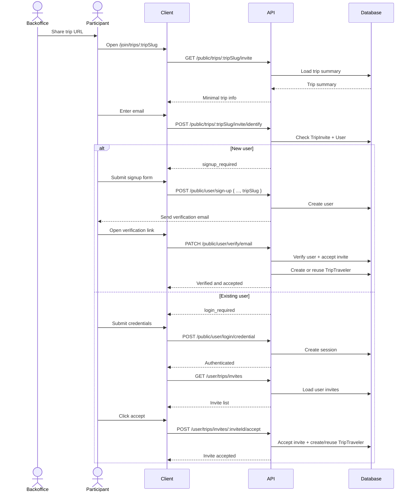

# Trip Invite Workflow

## Goal

Use one shared trip URL for all participants. The participant enters their email, then:

1. if the email belongs to a new user, the client reuses `POST /public/user/sign-up` with optional `tripSlug`
2. if the email belongs to an existing user, the client asks the user to log in
3. existing users explicitly accept the invite after login
4. new users become part of the trip only after email verification succeeds

## Proposed Flow

1. Backoffice shares a trip URL like `/join/trips/:tripSlug`.
2. Participant opens the page and enters `email`.
3. API checks `TripInvite` for `(trip, email)` and validates `INVITED`, not revoked, not expired.
4. If no user exists for that email:
   - client collects signup fields
   - client calls `POST /public/user/sign-up` with optional `tripSlug`
   - backend sends verification email
   - invite stays `INVITED`
   - once email is verified, backend marks invite `ACCEPTED` and creates or reuses `TripTraveler`
5. If a user already exists for that email:
   - client calls `POST /public/user/login/credential`
   - client loads all invites through `/user/trips/invites`
   - user selects or opens the trip invite
   - user clicks accept
   - backend marks invite `ACCEPTED` and creates or reuses `TripTraveler`

After acceptance, the user can access the trip via `/user/trips/:tripId/:tripSlug`.

## Mermaid

## Endpoints

### Public

1. `GET /public/trips/:tripSlug/invite`
   - Returns minimal trip information for the landing page.

2. `POST /public/trips/:tripSlug/invite/identify`
   - Input: `email`
   - Output: `signup_required`, `login_required`, or invite error state
   - This endpoint is vulnerable to brute force and participant enumeration.

3. `POST /public/user/sign-up`
   - Existing endpoint to reuse.
   - Proposed extension: optional `tripSlug`.
   - If `tripSlug` is present, backend re-validates invite by `(tripSlug, email)`.

4. `PATCH /public/user/verify/email`
   - Existing endpoint to reuse.
   - If sign-up came from an invite-linked `tripSlug`, verification should:
     - mark invite `ACCEPTED`
     - create or reuse `TripTraveler`

5. `POST /public/user/login/credential`
   - Existing endpoint to reuse for existing users.

### Authenticated

6. `GET /user/trips/invites`
   - Returns the authenticated user's invite list.
   - More reusable than a trip-specific pending endpoint.

7. `POST /user/trips/invites/:inviteId/accept`
   - Explicit accept for existing users.
   - Validates ownership, status, expiry, then creates or reuses `TripTraveler`.

8. `GET /user/trips/:tripId/:tripSlug`
   - Trip entrypoint after successful acceptance.

## Main Risk

`POST /public/trips/:tripSlug/invite/identify` is the weak point in this workflow.

It allows anyone with the shared URL to try many email addresses and infer:

1. who is invited to the trip
2. whether an invited email already has an account

At minimum, this needs rate limiting, bot protection, logging, and more generic responses. Another option is removing the public identify step entirely and validating invite state only during sign-up, login, and accept flows.

## Discussion Points

1. Reusing `POST /public/user/sign-up` with optional `tripSlug` is cleaner than adding trip-specific signup endpoints.
2. Invite-linked signup should not auto-login into the trip; email verification should be the event that accepts the invite.
3. Existing users should keep an explicit accept action.
4. `/user/trips/invites` is a better reusable surface than `/user/trips/invites/pending/:tripSlug`.
