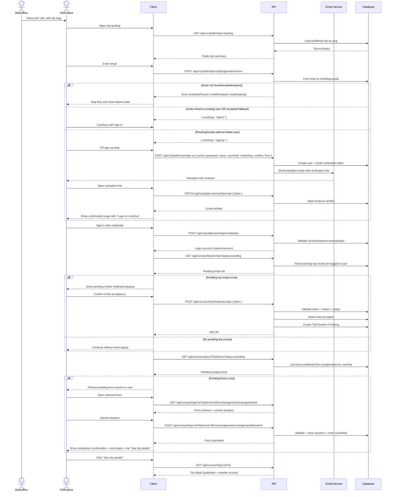

# Trip Invite (Current Implementation)

This file documents invite workflow, endpoints, and state rules as implemented.

## Endpoint Ownership

### Public/Auth Bootstrap

| Method | Path | Purpose |
| --- | --- | --- |
| `GET` | `/public/trips/:tripSlug` | Load public trip landing summary by slug. |
| `POST` | `/public/trips/:tripSlug/invites/check` | Resolve invite + next auth step (`signIn`/`signUp`). |
| `POST` | `/public/user/sign-up` | Create account for invitee signup flow. |
| `PATCH` | `/public/user/verify/email` | Verify account email via activation token. |
| `POST` | `/public/user/login/credential` | Log in with email/password before invite continuation. |

### Trip Invite Endpoints

| Method | Path | Purpose |
| --- | --- | --- |
| `GET` | `/user/trips/invites` | List current-user invites (trip user controller root). |
| `POST` | `/user/trips/invites/accept` | Accept invite token and attach traveler membership. |
| `GET` | `/user/trips/:idTrip` | Load trip detail after traveler access is granted. |
| `POST` | `/shared/trips/:idTrip/invites` | Create trip invites from shared surface. |
| `PATCH` | `/shared/trips/:idTrip/invites/:idInvite/revoke` | Revoke an invite from shared surface. |

### Post-Acceptance Form Endpoints

| Method | Path | Purpose |
| --- | --- | --- |
| `GET` | `/user/trips/:idTrip/forms` | List current-user form assignments for trip. |
| `GET` | `/user/trips/:idTrip/forms/:idForm/assignments/:assignmentId` | Read one assigned form with answers. |
| `POST` | `/user/trips/:idTrip/forms/:idForm/assignments/:assignmentId/submit` | Submit one form assignment response. |

## Invite Status Model

`TripInviteStatus` values:

1. `pending`
2. `invited`
3. `accepted`
4. `revoked`

Current write behavior:

1. Invite create flows set status to `pending`.
2. `check` treats `pending` and `invited` as signup-path states.
3. `accept` sets `accepted` and attaches/creates traveler.
4. `revoke` sets `revoked`.

## Validation Rules

1. `check` only resolves invites for published, non-deleted trips.
2. `accept` is token-based (`token` in body), not invite-id route-based.
3. `accept` rejects invalid token, revoked, expired, or already accepted invites.
4. `revoke` rejects already revoked invite.
5. `(tripId, email)` uniqueness is enforced in DB.

## Invite Workflow Diagram

## Security Notes

1. `invites/check` can be abused for invite-state probing and should have rate limiting and anti-bot controls.
2. Accept flow relies on raw token secrecy on client links.
3. Current create invite flow hashes raw tokens server-side; delivery channel is out of scope in this module.
