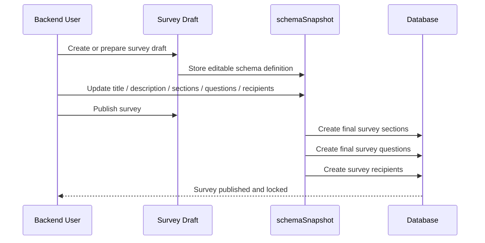
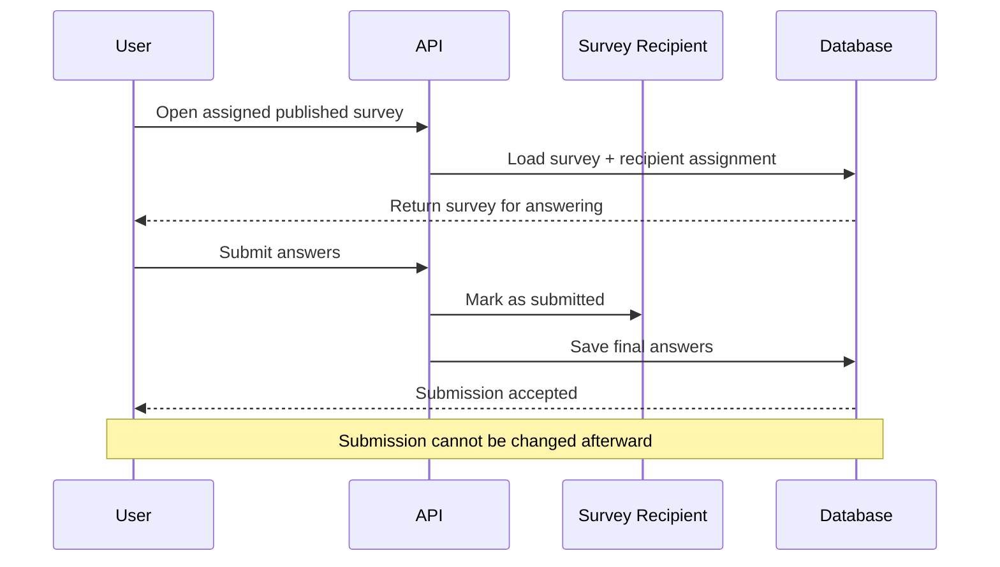

# Survey Documentation

This documentation explains the features and usage of **Survey Module**: Located at `src/modules/survey`

## Overview

Survey Module provides a structured way for backend users to prepare, publish, and collect survey responses from selected users.

At a high level, the feature works in two stages:

- **Draft stage**: the survey definition is prepared through `schemaSnapshot`
- **Published stage**: the survey becomes final, recipients are created, and users can submit answers

This module is designed so survey structure is flexible while being drafted, but immutable once it is published and sent to recipients.

## Related Documents

- [Authentication Documentation][ref-doc-authentication] - For JWT and API key requirements
- [Authorization Documentation][ref-doc-authorization] - For admin and user access control
- [Activity Log Documentation][ref-doc-activity-log] - For publish/archive/delete activity recording
- [Term Policy Documentation][ref-doc-term-policy] - For user access requirements before submitting surveys
- [Response Documentation][ref-doc-response] - For standardized API response format

## Table of Contents

- [Overview](#overview)
- [Related Documents](#related-documents)
- [Survey Concept](#survey-concept)
- [Survey Lifecycle](#survey-lifecycle)
  - [Draft Stage](#draft-stage)
  - [Publish Stage](#publish-stage)
  - [Submission Stage](#submission-stage)
- [Schema Snapshot](#schema-snapshot)
- [Flow](#flow)
  - [Backend Flow Diagram](#backend-flow-diagram)
  - [User Flow Diagram](#user-flow-diagram)
- [Important Rules](#important-rules)
- [Contribution](#contribution)

## Survey Concept

The survey feature is built for cases where the backend team needs to define a questionnaire, assign it to a set of users, and collect final answers only once.

A survey contains:

- survey metadata such as title and description
- a survey schema made of sections and questions
- a recipient list defining which users must answer the survey

The important design decision is that the editable survey definition lives first as a **snapshot of the schema**, not as final recipient answer records.

## Survey Lifecycle

### Draft Stage

Before a survey is published, the backend user works on the survey as a draft.

During this stage:

- the survey definition is stored in `schemaSnapshot`
- the structure can still be adjusted
- the survey is not yet considered active for end users
- recipients have not yet started answering

This draft stage is where the backend user finalizes:

- title
- description
- sections
- questions
- recipients
- closing date

### Publish Stage

When the backend user decides to publish the survey, the draft is finalized.

At publish time:

- `schemaSnapshot` is treated as the final source of truth for the survey definition
- the publish operation materializes the survey into full stored records
- survey sections are created
- survey questions are created
- survey recipients are created
- the survey becomes available for end users

After this point, the survey is considered **locked**:

- the survey can no longer be updated
- the question structure can no longer be changed
- the recipient assignment is considered final for that published survey

This rule exists to preserve consistency between:

- what users see
- what they answer
- what the backend stores as the official published survey structure

### Submission Stage

Once the survey is published, assigned users can open the survey and submit their answers.

When a user submits:

- answers are stored against that survey recipient
- the recipient is marked as submitted
- the submission becomes final

After submission:

- the user cannot update their answers anymore
- the same survey cannot be submitted again by the same recipient

This guarantees that each recipient has one final response for that survey.

## Schema Snapshot

`schemaSnapshot` is the core of the survey draft workflow.

It represents the survey definition before publication, including:

- survey title
- survey description
- survey sections
- survey questions and their configuration

Conceptually, `schemaSnapshot` is the editable survey blueprint.

Its purpose is to let the backend user shape the survey first, then publish it only when the structure is ready. Once published, that snapshot is no longer just a draft representation. It becomes the basis for creating the final survey structure stored by the backend.

In short:

- **before publish**: `schemaSnapshot` acts as the draft
- **on publish**: `schemaSnapshot` is finalized and materialized
- **after publish**: the survey is immutable

## Flow

### Backend Flow Diagram

### User Flow Diagram

## Important Rules

- A survey starts as a draft through `schemaSnapshot`
- Publishing converts that draft into the final survey structure
- Once published, the survey can no longer be updated
- Once a recipient submits answers, those answers can no longer be updated
- Each recipient has one final submission per survey

## Contribution

When extending this module:

1. Keep the draft-to-publish lifecycle explicit in both code and documentation.
2. Preserve the immutability rule after publish unless the product requirements change deliberately.
3. Preserve the immutability rule after user submission unless a formal answer-revision workflow is introduced.
4. If the lifecycle changes, update this document first so the feature contract stays clear.

<!-- REFERENCES -->

[ref-doc-authentication]: authentication.md
[ref-doc-authorization]: authorization.md
[ref-doc-activity-log]: activity-log.md
[ref-doc-term-policy]: term-policy.md
[ref-doc-response]: response.md
